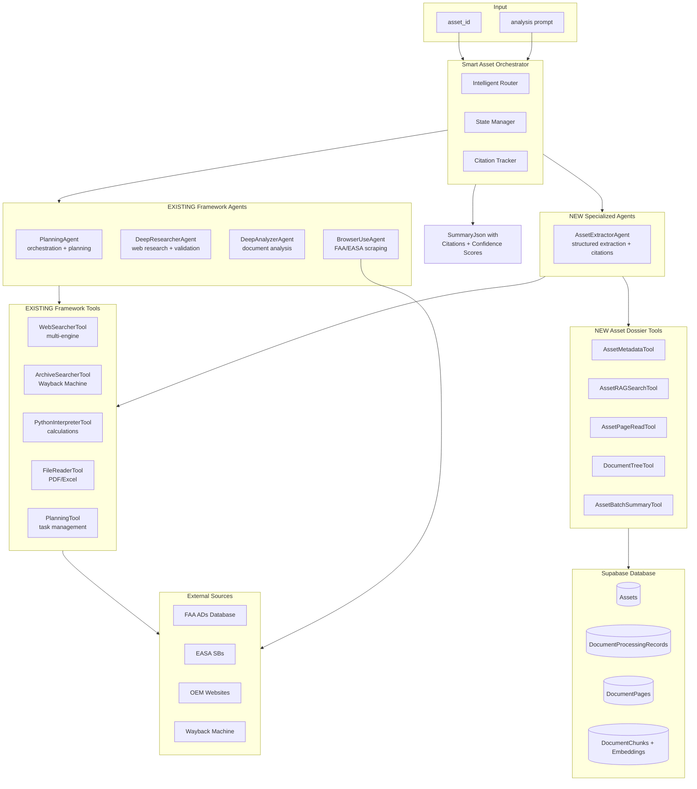

# Asset Dossier Research Agent (Extended Smart Agent)

## Overview

Build a **smart, composable** DeepResearchAgent that accepts an `asset_id` and analysis `prompt`, then autonomously analyzes the entire dossier (up to 10K+ pages) using:

1. **Supabase database** as its primary knowledge base (via new Asset Dossier tools)
2. **Existing DeepResearcherAgent** for web-based regulatory validation and OEM lookups
3. **Existing DeepAnalyzerAgent** for complex document analysis and cross-referencing
4. **Existing PlanningAgent** patterns for intelligent task orchestration
5. **Existing tools** (WebSearcher, ArchiveSearcher, PythonInterpreter) for enrichment
6. **MCP Integration** via Supabase MCP server for direct database operations

The agent produces a `SummaryJson`-compatible output where every extracted fact includes source page references, web citations, and confidence scores.

## Design Philosophy

> **Extend, don't recreate.** This agent builds ON TOP of the existing framework rather than reinventing components.

### What We REUSE (Existing Framework)

| Component | Existing Class | How We Use It |
|-----------|---------------|---------------|
| Planning | `PlanningAgent` | Orchestrates multi-phase research with `PlanningTool` |
| Web Research | `DeepResearcherAgent` | Validates ADs/SBs, fetches OEM data, regulatory lookups |
| Document Analysis | `DeepAnalyzerAgent` | Analyzes complex pages, cross-references documents |
| Browser Automation | `BrowserUseAgent` | Scrapes FAA/EASA databases when APIs unavailable |
| Multi-engine Search | `WebSearcherTool` | Firecrawl + DuckDuckGo + fallbacks |
| Historical Data | `ArchiveSearcherTool` | Wayback Machine for superseded SBs |
| Code Execution | `PythonInterpreterTool` | Data processing, calculations, JSON manipulation |
| File Reading | `FileReaderTool` | Process attached documents (PDFs, Excel) |

### What We CREATE (New Components)

| Component | New Class | Purpose |
|-----------|-----------|---------|
| DB Client | `SupabaseAsyncClient` | Async PostgreSQL connection pool |
| Asset Tools | 5 specialized tools | Database queries specific to asset dossiers |
| Extractor Agent | `AssetExtractorAgent` | Structured data extraction with citations |
| Smart Orchestrator | `SmartAssetOrchestrator` | Intelligent routing and state management |

## Architecture



### Smart Routing Logic

The `SmartAssetOrchestrator` intelligently routes tasks based on their nature:

```
┌─────────────────────────────────────────────────────────────────────────────┐
│                          TASK CLASSIFICATION                                 │
├─────────────────────────────────────────────────────────────────────────────┤
│ "Find all LLPs in the dossier"                                              │
│   → AssetExtractorAgent (RAG search + page read + structured extraction)    │
├─────────────────────────────────────────────────────────────────────────────┤
│ "Validate AD 2021-15-12 compliance"                                         │
│   → DeepResearcherAgent (FAA search) + AssetExtractorAgent (dossier check)  │
├─────────────────────────────────────────────────────────────────────────────┤
│ "Analyze maintenance history trends"                                         │
│   → DeepAnalyzerAgent (complex analysis) + PythonInterpreterTool (stats)    │
├─────────────────────────────────────────────────────────────────────────────┤
│ "Find superseded SB from 2018"                                              │
│   → ArchiveSearcherTool (Wayback) + AssetExtractorAgent (dossier context)   │
├─────────────────────────────────────────────────────────────────────────────┤
│ "Scrape current EASA AD list for engine type"                               │
│   → BrowserUseAgent (EASA website) + DeepResearcherAgent (validation)       │
└─────────────────────────────────────────────────────────────────────────────┘
```


## Phase 0: MCP Integration (Leverage Existing Supabase MCP)

Before building custom tools, leverage the **existing Supabase MCP server** that's already configured in this codebase.

### 0.1 Supabase MCP Server Usage

**Location**: `mcps/user-supabase/`

The Supabase MCP server provides direct database access. We can use it for:
- Direct SQL queries via `CallMcpTool`
- Schema introspection
- Bulk data retrieval

```python
# Example: Query asset metadata via MCP
result = await mcp_client.call_tool(
    server="user-supabase",
    tool_name="query",  # Check actual tool name in mcps/user-supabase/tools/
    arguments={"sql": "SELECT * FROM assets WHERE id = $1", "params": [asset_id]}
)
```

### 0.2 MCP Tool Configuration

**Add to config**: `configs/config_asset_research.py`

```python
# Enable MCP tools for direct Supabase access
mcp_tools = ["supabase_query", "supabase_rpc"]  # Verify actual tool names

mcp_tools_config = dict(
    supabase_query=dict(
        server="user-supabase",
        timeout=30
    )
)
```

## Phase 1: Asset Dossier Tools

Create new tools in `src/tools/asset_dossier/` that interface with the Sparengine database.

> **Note**: These tools complement the MCP server for specialized operations that benefit from custom logic.

### 1.1 Database Connection Tool

**File**: `src/tools/asset_dossier/db_client.py`

- Async PostgreSQL client using `asyncpg` (matches existing patterns in codebase)
- Connection pooling via `asyncpg.Pool` for concurrent operations
- Singleton pattern for connection reuse across tools
- Uses environment variables: `DATABASE_URL`

```python
import asyncpg
from typing import Optional

class SupabaseAsyncClient:
    """Singleton async PostgreSQL client for Sparengine database."""
    
    _instance: Optional['SupabaseAsyncClient'] = None
    _pool: Optional[asyncpg.Pool] = None
    
    @classmethod
    async def get_instance(cls) -> 'SupabaseAsyncClient':
        if cls._instance is None:
            cls._instance = cls()
            await cls._instance._initialize_pool()
        return cls._instance
    
    async def _initialize_pool(self):
        self._pool = await asyncpg.create_pool(
            dsn=os.environ["DATABASE_URL"],
            min_size=2,
            max_size=10,
            command_timeout=30
        )
    
    async def fetch(self, query: str, *args) -> list[asyncpg.Record]:
        async with self._pool.acquire() as conn:
            return await conn.fetch(query, *args)
    
    async def fetchrow(self, query: str, *args) -> Optional[asyncpg.Record]:
        async with self._pool.acquire() as conn:
            return await conn.fetchrow(query, *args)
    
    async def execute(self, query: str, *args) -> str:
        async with self._pool.acquire() as conn:
            return await conn.execute(query, *args)
```

### 1.2 AssetMetadataTool

**File**: `src/tools/asset_dossier/asset_metadata.py`

```python
# Returns asset overview:
# - Asset ID, name, status
# - Total documents, total pages
# - File structure tree (folder hierarchy)
# - Existing summary_json if available
# - Processing metadata
```

### 1.3 AssetRAGSearchTool

**File**: `src/tools/asset_dossier/asset_rag_search.py`

```python
# Semantic search using pgvector embeddings
# Input: query string, asset_id, limit, min_similarity
# Output: List of matching pages with:
#   - pageId, documentId, documentName, pageIndex
#   - similarity score
#   - text snippet
#   - enhancedS3Key for image reference
```

Leverages existing `SearchService.searchAssetPages()` pattern from `server/src/services/search.service.ts`.

### 1.4 AssetPageReadTool

**File**: `src/tools/asset_dossier/asset_page_read.py`

```python
# Read specific pages by ID or by document path + page index
# Input: page_ids[] or (document_path, page_range)
# Output: Full extracted_json content for each page
#   with source metadata for citation
```

### 1.5 DocumentTreeTool

**File**: `src/tools/asset_dossier/document_tree.py`

```python
# Navigate and filter document tree
# Input: asset_id, filter (by type, path pattern, etc.)
# Output: Filtered document list with:
#   - documentId, fileName, originalPath
#   - pageCount, status
#   - relevant page IDs for the filter
```

### 1.6 AssetBatchSummaryTool

**File**: `src/tools/asset_dossier/asset_batch_summary.py`

```python
# Retrieve existing aggregation batches (pre-computed summaries)
# Useful for large assets where Tier 2/3 aggregation exists
# Input: asset_id
# Output: List of batch summaries with source_pages
```

## Phase 2: Smart Agent Architecture (Leveraging Existing Agents)

### 2.1 Agent Configuration (Reusing Existing Types)

**File**: `configs/config_asset_research.py`

```python
_base_ = './base.py'

tag = "asset_research"
use_hierarchical_agent = True

# ============================================================================
# MAIN ORCHESTRATOR: Uses existing PlanningAgent with asset-specific prompts
# ============================================================================
planning_agent_config = dict(
    type="planning_agent",  # REUSE existing PlanningAgent class
    name="asset_research_orchestrator",
    model_id="claude-3.7-sonnet-thinking",
    max_steps=30,
    template_path="src/agent/asset_research_prompts/orchestrator.yaml",  # Custom prompts
    provide_run_summary=True,
    tools=["planning_tool"],
    managed_agents=[
        "asset_extractor_agent",
        "deep_researcher_agent",  # REUSE existing
        "deep_analyzer_agent",    # REUSE existing
        "browser_use_agent"       # REUSE existing (optional)
    ]
)

# ============================================================================
# ASSET EXTRACTOR: New agent for structured extraction with citations
# ============================================================================
asset_extractor_agent_config = dict(
    type="asset_extractor_agent",  # NEW agent type (extends GeneralAgent)
    name="asset_extractor_agent",
    model_id="claude-3.7-sonnet-thinking",
    max_steps=20,
    template_path="src/agent/asset_extractor_agent/prompts/asset_extractor_agent.yaml",
    provide_run_summary=True,
    tools=[
        # NEW asset dossier tools
        "asset_metadata_tool",
        "asset_rag_search_tool",
        "asset_page_read_tool",
        "document_tree_tool",
        "asset_batch_summary_tool",
        # EXISTING tools for processing
        "python_interpreter_tool",
        "file_reader_tool"
    ]
)

# ============================================================================
# DEEP RESEARCHER: Reuse existing for web validation + regulatory lookups
# ============================================================================
deep_researcher_agent_config = dict(
    type="deep_researcher_agent",  # REUSE existing DeepResearcherAgent
    name="regulatory_researcher_agent",
    model_id="gpt-4.1",
    max_steps=15,
    template_path="src/agent/asset_research_prompts/regulatory_researcher.yaml",  # Custom prompts
    provide_run_summary=True,
    tools=[
        "deep_researcher_tool",    # EXISTING: multi-level web research
        "archive_searcher_tool",   # EXISTING: Wayback Machine for superseded SBs
        "web_searcher_tool",       # EXISTING: multi-engine search
        "web_fetcher_tool"         # EXISTING: page fetching
    ]
)

# ============================================================================
# DEEP ANALYZER: Reuse existing for complex document analysis
# ============================================================================
deep_analyzer_agent_config = dict(
    type="deep_analyzer_agent",  # REUSE existing DeepAnalyzerAgent
    name="document_analyzer_agent",
    model_id="claude-3.7-sonnet-thinking",
    max_steps=15,
    template_path="src/agent/asset_research_prompts/document_analyzer.yaml",  # Custom prompts
    provide_run_summary=True,
    tools=[
        "deep_analyzer_tool",      # EXISTING: multi-model analysis
        "python_interpreter_tool", # EXISTING: calculations and data processing
        "file_reader_tool"         # EXISTING: read various file formats
    ]
)

# ============================================================================
# BROWSER AGENT: Reuse existing for FAA/EASA scraping (optional)
# ============================================================================
browser_use_agent_config = dict(
    type="browser_use_agent",  # REUSE existing BrowserUseAgent
    name="regulatory_scraper_agent",
    model_id="gpt-4.1",
    max_steps=10,
    template_path="src/agent/asset_research_prompts/regulatory_scraper.yaml",
    tools=[
        "auto_browser_use_tool",   # EXISTING: high-level browser automation
        "browser_use_tool"         # EXISTING: low-level browser control
    ]
)

# ============================================================================
# MCP TOOLS: Direct Supabase access
# ============================================================================
mcp_tools = []  # Add after verifying available tools in mcps/user-supabase/

# ============================================================================
# TOOL CONFIGURATIONS
# ============================================================================
# Asset dossier tools use the shared database client
asset_metadata_tool_config = dict(type="asset_metadata_tool")
asset_rag_search_tool_config = dict(type="asset_rag_search_tool", default_limit=20)
asset_page_read_tool_config = dict(type="asset_page_read_tool", max_pages_per_request=10)
document_tree_tool_config = dict(type="document_tree_tool")
asset_batch_summary_tool_config = dict(type="asset_batch_summary_tool")

# Existing tools can be customized
deep_researcher_tool_config = dict(
    type="deep_researcher_tool",
    max_depth=3,  # Deeper research for regulatory validation
    time_limit=120
)
```

### 2.2 Custom Prompt Templates (Extending Existing Patterns)

Instead of creating new agent classes, we provide **custom YAML prompts** that specialize the existing agents.

#### Orchestrator Prompts

**File**: `src/agent/asset_research_prompts/orchestrator.yaml`

```yaml
system_prompt: |-
  You are the Asset Dossier Research Orchestrator. Your job is to analyze 
  aircraft maintenance dossiers by coordinating specialized agents.
  
  ## Available Managed Agents
  
  {{managed_agents}}
  
  ## Agent Selection Guide
  
  | Task Type | Use This Agent |
  |-----------|----------------|
  | Extract data from dossier pages | asset_extractor_agent |
  | Validate ADs/SBs against FAA/EASA | regulatory_researcher_agent (deep_researcher) |
  | Analyze complex documents, cross-reference | document_analyzer_agent (deep_analyzer) |
  | Scrape regulatory websites when APIs fail | regulatory_scraper_agent (browser_use) |
  
  ## Research Phases
  
  1. **Discovery**: Use asset_extractor_agent to understand dossier structure
  2. **Extraction**: Extract requested data with full citations
  3. **Validation**: Use regulatory_researcher_agent to validate external references
  4. **Analysis**: Use document_analyzer_agent for complex cross-referencing
  5. **Synthesis**: Combine all findings into structured output
  
  ## Citation Requirements
  
  EVERY extracted fact MUST include:
  - source_pages: List of page IDs where the fact was found
  - confidence: "high" | "medium" | "low"
  - validation_status: "verified" | "unverified" | "contradicted"

task_instruction: |-
  ## Asset Research Task
  
  Asset ID: {{asset_id}}
  
  Research Request: {{task}}
  
  Produce a comprehensive structured report with full source citations.
  Use the planning_tool to track your progress through the research phases.

managed_agent:
  task: |-
    You are working as a specialized agent for the Asset Dossier Research Orchestrator.
    
    Asset Context:
    - Asset ID: {{asset_id}}
    - Total Pages: {{total_pages}}
    - Document Types: {{document_types}}
    
    Your Task: {{task}}
    
    Requirements:
    - Include source page IDs for every extracted fact
    - Note confidence level for each finding
    - Report any gaps or contradictions found
  
  report: |-
    Agent Report from {{agent.name}}:
    
    {{final_answer}}

final_answer:
  pre_messages: |-
    Based on your research, provide the final structured output in JSON format.
```

#### Regulatory Researcher Prompts

**File**: `src/agent/asset_research_prompts/regulatory_researcher.yaml`

```yaml
system_prompt: |-
  You are a specialized regulatory research agent for aviation maintenance.
  
  ## Your Expertise
  - FAA Airworthiness Directives (ADs)
  - EASA ADs and Safety Information Bulletins
  - OEM Service Bulletins (SBs)
  - Type Certificate Data Sheets (TCDS)
  - Supplemental Type Certificates (STCs)
  
  ## Available Tools
  
  {{tools}}
  
  ## Research Strategy
  
  1. Use deep_researcher_tool for comprehensive multi-level research
  2. Use archive_searcher_tool for superseded/historical documents
  3. Use web_searcher_tool for quick lookups
  4. Always cite your sources with URLs and access dates
  
  ## Key Databases
  
  - FAA AD Database: https://www.faa.gov/regulations_policies/airworthiness_directives
  - EASA AD Database: https://ad.easa.europa.eu/
  - FAA TCDS: https://rgl.faa.gov/
  - EASA TCDS: https://www.easa.europa.eu/en/document-library/type-certificates

task_instruction: |-
  ## Regulatory Validation Task
  
  {{task}}
  
  Provide:
  1. Current status of referenced ADs/SBs
  2. Compliance requirements
  3. Related/superseding documents
  4. Source URLs with access timestamps
```

### 2.3 Asset Extractor Agent (Only New Agent Class)

**File**: `src/agent/asset_extractor_agent/asset_extractor_agent.py`

This is the **only new agent class** we need to create. It extends `GeneralAgent` with citation-tracking capabilities.

```python
from src.agent.general_agent import GeneralAgent
from src.registry import AGENT
from typing import Dict, List, Any

@AGENT.register_module(name="asset_extractor_agent", force=True)
class AssetExtractorAgent(GeneralAgent):
    """
    Specialized agent for extracting structured data from asset dossiers.
    Extends GeneralAgent with citation tracking and batch processing.
    """
    
    def __init__(self, config):
        super().__init__(config)
        self.citation_tracker: Dict[str, List[str]] = {}
        self.extraction_buffer: List[Dict[str, Any]] = []
    
    def track_citation(self, fact_id: str, page_ids: List[str], confidence: str = "high"):
        """Track source pages for each extracted fact."""
        self.citation_tracker[fact_id] = {
            "source_pages": page_ids,
            "confidence": confidence,
            "extracted_at": datetime.utcnow().isoformat()
        }
    
    def get_citations_summary(self) -> Dict[str, Any]:
        """Return all tracked citations."""
        return {
            "total_facts": len(self.citation_tracker),
            "citations": self.citation_tracker
        }
    
    async def extract_with_citations(self, extraction_task: str) -> Dict[str, Any]:
        """Run extraction and return results with citation metadata."""
        result = await self.run(extraction_task)
        return {
            "extraction_result": result,
            "citations": self.get_citations_summary()
        }
```

### 2.4 Smart Orchestrator Mixin (Optional Enhancement)

**File**: `src/agent/asset_research_prompts/smart_orchestrator_mixin.py`

For advanced use cases, we can add a mixin that provides intelligent routing:

```python
from typing import Dict, Any, List
import re

class SmartOrchestratorMixin:
    """
    Mixin that provides intelligent task routing based on task analysis.
    Can be mixed into PlanningAgent for smarter orchestration.
    """
    
    TASK_PATTERNS = {
        "asset_extractor_agent": [
            r"find\s+.*\s+in\s+(the\s+)?dossier",
            r"extract\s+.*\s+from\s+pages?",
            r"list\s+all\s+(LLPs?|components?|parts?)",
            r"what\s+.*\s+in\s+(the\s+)?records?",
        ],
        "regulatory_researcher_agent": [
            r"validate\s+AD\s*[-#]?\s*\d+",
            r"check\s+SB\s+compliance",
            r"FAA|EASA|regulatory",
            r"airworthiness\s+directive",
        ],
        "document_analyzer_agent": [
            r"analyze\s+.*\s+(trend|pattern|history)",
            r"cross-?reference",
            r"compare\s+.*\s+documents?",
            r"summarize\s+maintenance\s+history",
        ],
        "regulatory_scraper_agent": [
            r"scrape\s+.*\s+(FAA|EASA)",
            r"get\s+current\s+AD\s+list",
            r"download\s+.*\s+from\s+website",
        ]
    }
    
    def suggest_agent(self, task: str) -> str:
        """Suggest the best agent for a given task."""
        task_lower = task.lower()
        
        scores = {}
        for agent, patterns in self.TASK_PATTERNS.items():
            score = sum(1 for p in patterns if re.search(p, task_lower, re.IGNORECASE))
            if score > 0:
                scores[agent] = score
        
        if scores:
            return max(scores, key=scores.get)
        return "asset_extractor_agent"  # Default
    
    def plan_research_phases(self, task: str, asset_metadata: Dict) -> List[Dict[str, Any]]:
        """Generate a research plan based on task and asset size."""
        total_pages = asset_metadata.get("total_pages", 0)
        
        phases = [
            {"phase": "discovery", "agent": "asset_extractor_agent", 
             "task": "Get asset overview and document structure"},
        ]
        
        # Add validation phase if regulatory terms detected
        if re.search(r"AD|SB|compliance|regulatory", task, re.IGNORECASE):
            phases.append({
                "phase": "validation", 
                "agent": "regulatory_researcher_agent",
                "task": "Validate regulatory references against FAA/EASA"
            })
        
        # Add analysis phase for large dossiers
        if total_pages > 1000:
            phases.append({
                "phase": "analysis",
                "agent": "document_analyzer_agent", 
                "task": "Analyze trends and cross-reference large document set"
            })
        
        phases.append({
            "phase": "synthesis",
            "agent": "asset_extractor_agent",
            "task": "Compile final structured output with all citations"
        })
        
        return phases
```

## Phase 3: Output Schema (With Citation Tracking)

### 3.1 Enhanced SummaryJson Schema

Extend existing `SummaryJson` from `client/src/lib/summary-types.ts`:

```typescript
// ============================================================================
// CITATION TYPES (New)
// ============================================================================
interface SourceCitation {
  page_id: string;
  document_id: string;
  document_name: string;
  page_index: number;
  excerpt?: string;  // Relevant text snippet
  confidence: "high" | "medium" | "low";
}

interface WebCitation {
  url: string;
  title: string;
  accessed_at: string;  // ISO timestamp
  archived_url?: string;  // Wayback Machine URL if available
  source_type: "faa" | "easa" | "oem" | "other";
}

interface CitedFact<T> {
  value: T;
  source_pages: SourceCitation[];
  web_sources?: WebCitation[];
  validation_status: "verified" | "unverified" | "contradicted";
  notes?: string;
}

// ============================================================================
// MAIN OUTPUT SCHEMA
// ============================================================================
interface AssetResearchOutput extends SummaryJson {
  // Research metadata
  research_metadata: {
    asset_id: string;
    prompt: string;
    total_pages_analyzed: number;
    total_pages_in_asset: number;
    research_depth: "quick" | "standard" | "comprehensive";
    processing_time_ms: number;
    agent_version: string;
    agents_used: string[];  // Track which agents contributed
    tools_invoked: { tool: string; count: number }[];
  };
  
  // Enhanced aircraft identification (every field is CitedFact)
  aircraft_identity: {
    airframe: CitedFact<AirframeInfo>;
    engines: CitedFact<EngineInfo>[];
    configuration_summary: CitedFact<string>;
  };
  
  // Component inventory with full traceability
  component_inventory: {
    life_limited_parts: CitedFact<LLPInfo>[];
    rotables: CitedFact<ComponentInfo>[];
    modules: CitedFact<ModuleInfo>[];
  };
  
  // Maintenance history timeline
  maintenance_timeline: {
    events: CitedFact<MaintenanceEvent>[];
    overhauls: CitedFact<OverhaulInfo>[];
    inspections: CitedFact<InspectionInfo>[];
  };
  
  // Compliance tracking (with web validation)
  compliance_status: {
    ad_sb_status: (CitedFact<ADSBStatus> & { 
      faa_validation?: WebCitation;
      easa_validation?: WebCitation;
    })[];
    scheduled_maintenance: CitedFact<ScheduledMaintenanceInfo>[];
    regulatory_items: CitedFact<RegulatoryItem>[];
  };
  
  // Analysis findings (leveraging DeepAnalyzerAgent output)
  analysis_findings: {
    gaps: CitedFact<GapInfo>[];
    contradictions: {
      description: string;
      sources_a: SourceCitation[];
      sources_b: SourceCitation[];
      resolution?: string;
    }[];
    suspicious_items: CitedFact<SuspiciousItem>[];
    recommendations: string[];
    confidence_summary: {
      high_confidence_facts: number;
      medium_confidence_facts: number;
      low_confidence_facts: number;
      web_validated_facts: number;
    };
  };
}
```

### 3.2 Python Pydantic Models

**File**: `src/schemas/asset_research_output.py`

```python
from pydantic import BaseModel, Field
from typing import List, Optional, Literal, TypeVar, Generic
from datetime import datetime

T = TypeVar('T')

class SourceCitation(BaseModel):
    page_id: str
    document_id: str
    document_name: str
    page_index: int
    excerpt: Optional[str] = None
    confidence: Literal["high", "medium", "low"] = "medium"

class WebCitation(BaseModel):
    url: str
    title: str
    accessed_at: datetime
    archived_url: Optional[str] = None
    source_type: Literal["faa", "easa", "oem", "other"] = "other"

class CitedFact(BaseModel, Generic[T]):
    value: T
    source_pages: List[SourceCitation]
    web_sources: Optional[List[WebCitation]] = None
    validation_status: Literal["verified", "unverified", "contradicted"] = "unverified"
    notes: Optional[str] = None

class ResearchMetadata(BaseModel):
    asset_id: str
    prompt: str
    total_pages_analyzed: int
    total_pages_in_asset: int
    research_depth: Literal["quick", "standard", "comprehensive"]
    processing_time_ms: int
    agent_version: str = "1.0.0"
    agents_used: List[str] = Field(default_factory=list)
    tools_invoked: List[dict] = Field(default_factory=list)

class ConfidenceSummary(BaseModel):
    high_confidence_facts: int = 0
    medium_confidence_facts: int = 0
    low_confidence_facts: int = 0
    web_validated_facts: int = 0

class AssetResearchOutput(BaseModel):
    """Full research output with citations."""
    research_metadata: ResearchMetadata
    aircraft_identity: dict  # Flexible to match SummaryJson
    component_inventory: dict
    maintenance_timeline: dict
    compliance_status: dict
    analysis_findings: dict
    
    class Config:
        extra = "allow"  # Allow additional fields for SummaryJson compatibility
```

## Phase 4: Entry Point and Integration

### 4.1 Main Entry Point (Following Existing Patterns)

**File**: `examples/run_asset_research.py`

Following the patterns in `run_gaia.py` and `run_general.py`:

```python
#!/usr/bin/env python3
"""
Asset Dossier Research Agent Entry Point

Analyzes aircraft maintenance dossiers using the full DeepResearchAgent framework.

Usage:
    python examples/run_asset_research.py --asset-id "asset_123" --prompt "Extract all LLPs"
    python examples/run_asset_research.py --asset-id "asset_123" --depth comprehensive
"""

import asyncio
import argparse
import json
from datetime import datetime
from pathlib import Path

from src.config import config
from src.logger import logger
from src.models import model_manager
from src.agent import create_agent
from src.agent.reformulator import prepare_response
from src.tools.asset_dossier import SupabaseAsyncClient
from src.schemas.asset_research_output import AssetResearchOutput, ResearchMetadata


def parse_args():
    parser = argparse.ArgumentParser(description="Asset Dossier Research Agent")
    parser.add_argument("--config", default="configs/config_asset_research.py",
                        help="Path to configuration file")
    parser.add_argument("--asset-id", required=True, help="Asset ID to analyze")
    parser.add_argument("--prompt", default="Produce a comprehensive analysis",
                        help="Analysis prompt/question")
    parser.add_argument("--depth", choices=["quick", "standard", "comprehensive"],
                        default="standard", help="Research depth")
    parser.add_argument("--output", help="Output JSON file path")
    parser.add_argument("--stream", action="store_true", help="Enable streaming output")
    parser.add_argument("--cfg-options", nargs="+", default=[],
                        help="Override config options (key=value)")
    return parser.parse_args()


async def get_asset_context(asset_id: str) -> dict:
    """Fetch asset metadata for context injection."""
    db = await SupabaseAsyncClient.get_instance()
    
    # Get asset overview
    asset = await db.fetchrow("""
        SELECT a.id, a.name, a.status, 
               COUNT(DISTINCT dpr.id) as total_documents,
               COUNT(DISTINCT dp.id) as total_pages
        FROM assets a
        LEFT JOIN document_processing_records dpr ON dpr.asset_id = a.id
        LEFT JOIN document_pages dp ON dp.document_processing_record_id = dpr.id
        WHERE a.id = $1
        GROUP BY a.id
    """, asset_id)
    
    if not asset:
        raise ValueError(f"Asset not found: {asset_id}")
    
    # Get document types
    doc_types = await db.fetch("""
        SELECT DISTINCT 
            CASE 
                WHEN original_path ILIKE '%logbook%' THEN 'Logbook'
                WHEN original_path ILIKE '%workorder%' OR original_path ILIKE '%work order%' THEN 'Work Order'
                WHEN original_path ILIKE '%sb%' OR original_path ILIKE '%service bulletin%' THEN 'Service Bulletin'
                WHEN original_path ILIKE '%ad%' OR original_path ILIKE '%airworthiness%' THEN 'AD Compliance'
                ELSE 'Other'
            END as doc_type
        FROM document_processing_records
        WHERE asset_id = $1
    """, asset_id)
    
    return {
        "asset_id": asset_id,
        "asset_name": asset["name"],
        "status": asset["status"],
        "total_documents": asset["total_documents"],
        "total_pages": asset["total_pages"],
        "document_types": [d["doc_type"] for d in doc_types]
    }


async def main():
    args = parse_args()
    start_time = datetime.utcnow()
    
    # 1. Initialize configuration (following existing pattern)
    config.init_config(args.config, args)
    
    # 2. Initialize logger
    logger.init_logger(log_path=config.log_path)
    logger.info(f"Starting Asset Research for: {args.asset_id}")
    
    # 3. Initialize models
    model_manager.init_models(use_local_proxy=config.use_local_proxy)
    
    # 4. Get asset context for prompt injection
    asset_context = await get_asset_context(args.asset_id)
    logger.info(f"Asset: {asset_context['asset_name']} - {asset_context['total_pages']} pages")
    
    # 5. Build the task with context
    task = f"""
## Asset Dossier Research Task

### Asset Information
- Asset ID: {args.asset_id}
- Asset Name: {asset_context['asset_name']}
- Total Documents: {asset_context['total_documents']}
- Total Pages: {asset_context['total_pages']}
- Document Types: {', '.join(asset_context['document_types'])}

### Research Request
{args.prompt}

### Research Depth
{args.depth}

### Requirements
1. Every extracted fact MUST include source page citations
2. Validate regulatory references (ADs, SBs) against FAA/EASA databases
3. Report confidence levels for each finding
4. Identify gaps and contradictions
5. Output must be valid JSON matching AssetResearchOutput schema
"""
    
    # 6. Create agent (using existing hierarchical agent factory)
    agent = await create_agent(config)
    
    # 7. Run the agent
    if args.stream:
        # Streaming mode (following existing pattern)
        async for chunk in agent.run_stream(task):
            print(chunk, end="", flush=True)
        result = agent.final_answer
    else:
        result = await agent.run(task)
    
    # 8. Prepare final response with reformulation (existing feature)
    final_result = await prepare_response(
        task=task,
        agent_memory=agent.memory,
        reformulation_model=model_manager.registed_models.get(
            config.get("reformulation_model_id", "gpt-4.1")
        )
    )
    
    # 9. Build output with metadata
    processing_time = (datetime.utcnow() - start_time).total_seconds() * 1000
    
    output = {
        "research_metadata": {
            "asset_id": args.asset_id,
            "prompt": args.prompt,
            "total_pages_analyzed": asset_context["total_pages"],  # Will be refined by agent
            "total_pages_in_asset": asset_context["total_pages"],
            "research_depth": args.depth,
            "processing_time_ms": int(processing_time),
            "agent_version": "1.0.0",
            "agents_used": list(agent.managed_agents.keys()) if hasattr(agent, 'managed_agents') else [],
        },
        "result": final_result
    }
    
    # 10. Save output
    output_path = args.output or f"outputs/asset_research_{args.asset_id}_{datetime.utcnow().strftime('%Y%m%d_%H%M%S')}.json"
    Path(output_path).parent.mkdir(parents=True, exist_ok=True)
    
    with open(output_path, "w") as f:
        json.dump(output, f, indent=2, default=str)
    
    logger.info(f"Research complete. Output saved to: {output_path}")
    return output


if __name__ == "__main__":
    asyncio.run(main())
```

### 4.2 API Integration (FastAPI)

**File**: `src/api/asset_research_api.py`

REST endpoint for triggering research from Sparengine server:

```python
from fastapi import FastAPI, HTTPException, BackgroundTasks
from pydantic import BaseModel
from typing import Optional
import asyncio
import uuid

from src.config import config
from src.models import model_manager
from src.agent import create_agent

app = FastAPI(title="Asset Dossier Research API")

# In-memory job store (use Redis in production)
jobs: dict = {}

class ResearchRequest(BaseModel):
    asset_id: str
    prompt: str
    depth: str = "standard"
    webhook_url: Optional[str] = None

class ResearchResponse(BaseModel):
    job_id: str
    status: str
    result: Optional[dict] = None

@app.on_event("startup")
async def startup():
    config.init_config("configs/config_asset_research.py")
    model_manager.init_models()

@app.post("/research", response_model=ResearchResponse)
async def start_research(request: ResearchRequest, background_tasks: BackgroundTasks):
    """Start an async research job."""
    job_id = str(uuid.uuid4())
    jobs[job_id] = {"status": "pending", "result": None}
    
    background_tasks.add_task(run_research, job_id, request)
    
    return ResearchResponse(job_id=job_id, status="pending")

@app.get("/research/{job_id}", response_model=ResearchResponse)
async def get_research_status(job_id: str):
    """Get status of a research job."""
    if job_id not in jobs:
        raise HTTPException(status_code=404, detail="Job not found")
    
    job = jobs[job_id]
    return ResearchResponse(job_id=job_id, status=job["status"], result=job["result"])

async def run_research(job_id: str, request: ResearchRequest):
    """Background task to run research."""
    try:
        jobs[job_id]["status"] = "running"
        
        agent = await create_agent(config)
        task = f"Analyze asset {request.asset_id}: {request.prompt}"
        result = await agent.run(task)
        
        jobs[job_id] = {"status": "completed", "result": result}
        
        # Webhook callback if provided
        if request.webhook_url:
            import httpx
            async with httpx.AsyncClient() as client:
                await client.post(request.webhook_url, json={"job_id": job_id, "result": result})
    
    except Exception as e:
        jobs[job_id] = {"status": "failed", "result": {"error": str(e)}}
```

## Implementation Files Summary

### New Files to Create

| File | Description | Status |
|------|-------------|--------|
| **Asset Dossier Tools** | | |
| `src/tools/asset_dossier/__init__.py` | Package init + exports | New |
| `src/tools/asset_dossier/db_client.py` | Async PostgreSQL client (singleton) | New |
| `src/tools/asset_dossier/asset_metadata.py` | AssetMetadataTool | New |
| `src/tools/asset_dossier/asset_rag_search.py` | AssetRAGSearchTool (pgvector) | New |
| `src/tools/asset_dossier/asset_page_read.py` | AssetPageReadTool | New |
| `src/tools/asset_dossier/document_tree.py` | DocumentTreeTool | New |
| `src/tools/asset_dossier/asset_batch_summary.py` | AssetBatchSummaryTool | New |
| **Agent & Prompts** | | |
| `src/agent/asset_extractor_agent/` | Only new agent class (extends GeneralAgent) | New |
| `src/agent/asset_research_prompts/` | Custom YAML prompts for existing agents | New |
| `src/agent/mixins/context_aware_mixin.py` | Budget management mixin for agents | New |
| **Token & Context Management** | | |
| `src/config/model_limits.py` | Model token limits registry (all LLMs) | New |
| `src/utils/token_counter.py` | Token counting with tiktoken | New |
| `src/utils/context_budget.py` | Context budget manager + truncation | New |
| **Canvas Working Memory** | | |
| `src/memory/canvas.py` | Working memory canvas implementation | New |
| `src/tools/canvas_tool.py` | Canvas tool for agents | New |
| **Schemas & Config** | | |
| `src/schemas/asset_research_output.py` | Pydantic output models | New |
| `configs/config_asset_research.py` | Configuration file | New |
| **Entry Points** | | |
| `examples/run_asset_research.py` | Entry point script | New |
| `src/api/asset_research_api.py` | FastAPI endpoint (optional) | New |

### Existing Files to Leverage (No Modification)

| File | What We Use | How |
|------|-------------|-----|
| `src/agent/planning_agent/` | PlanningAgent class | Reuse with custom prompts |
| `src/agent/deep_researcher_agent/` | DeepResearcherAgent class | Reuse for web research |
| `src/agent/deep_analyzer_agent/` | DeepAnalyzerAgent class | Reuse for document analysis |
| `src/agent/browser_use_agent/` | BrowserUseAgent class | Reuse for FAA/EASA scraping |
| `src/agent/general_agent/` | GeneralAgent base class | Extend for AssetExtractorAgent |
| `src/tools/deep_researcher.py` | DeepResearcherTool | Multi-level web research |
| `src/tools/web_searcher.py` | WebSearcherTool | Multi-engine search |
| `src/tools/archive_searcher.py` | ArchiveSearcherTool | Wayback Machine |
| `src/tools/deep_analyzer.py` | DeepAnalyzerTool | Document analysis |
| `src/tools/python_interpreter.py` | PythonInterpreterTool | Data processing |
| `src/tools/file_reader.py` | FileReaderTool | File reading |
| `src/tools/planning.py` | PlanningTool | Task management |
| `src/base/async_multistep_agent.py` | Base agent class | Foundation for all agents |
| `src/memory/memory.py` | AgentMemory | Conversation tracking |
| `src/models/` | Model registry | LLM access |
| `configs/base.py` | build_agent, create_agent | Agent factory functions |
| `mcps/user-supabase/` | Supabase MCP server | Direct DB access |

### Files to Modify (Minimal Changes)

| File | Change |
|------|--------|
| `src/tools/__init__.py` | Add imports for new asset_dossier tools |
| `src/registry.py` | Already auto-discovers, no change needed |

## Key Design Decisions

### Reuse-First Philosophy

1. **Extend, Don't Recreate**: Only create ONE new agent class (AssetExtractorAgent). All other agents are existing framework agents with custom prompts.

2. **Prompt-Driven Specialization**: Instead of new agent classes, we use custom YAML prompt templates to specialize existing agents for asset research tasks.

3. **Tool Composition**: New asset dossier tools work alongside existing tools (WebSearcher, ArchiveSearcher, DeepAnalyzer) in the same agent configurations.

### Technical Decisions

4. **Database as Primary Source**: Agent queries Supabase directly via async PostgreSQL (asyncpg), not HTTP APIs, for performance with 10K+ page dossiers.

5. **Embeddings for Scale**: Uses existing pgvector embeddings via AssetRAGSearchTool for efficient semantic search across large document sets.

6. **MCP Integration**: Leverages the existing Supabase MCP server in `mcps/user-supabase/` for direct database operations when appropriate.

7. **Hierarchical Processing**: Uses existing PlanningAgent patterns to coordinate specialized sub-agents (DeepResearcher for web, DeepAnalyzer for analysis, etc.)

8. **Citation-First Design**: Every tool output includes source metadata. The new `CitedFact<T>` generic type ensures traceability throughout.

9. **Existing Schema Compatibility**: Output extends `SummaryJson` for UI compatibility, wrapping values in `CitedFact<T>` for citation tracking.

10. **Intelligent Routing**: SmartOrchestratorMixin provides pattern-based task routing to the most appropriate agent.

## Phase 5: Framework Integration Details

### 5.1 How Existing Agents Are Reused

```
┌─────────────────────────────────────────────────────────────────────────────┐
│                          AGENT REUSE STRATEGY                                │
├─────────────────────────────────────────────────────────────────────────────┤
│                                                                              │
│  ┌──────────────────┐     Custom Prompts      ┌──────────────────────────┐  │
│  │  PlanningAgent   │ ◄───────────────────── │  orchestrator.yaml        │  │
│  │  (existing)      │                         │  • Asset research phases  │  │
│  └────────┬─────────┘                         │  • Agent selection guide  │  │
│           │                                   │  • Citation requirements  │  │
│           │ manages                           └──────────────────────────┘  │
│           ▼                                                                  │
│  ┌──────────────────┐     Custom Prompts      ┌──────────────────────────┐  │
│  │ DeepResearcher   │ ◄───────────────────── │  regulatory_researcher.yaml│ │
│  │ Agent (existing) │                         │  • FAA/EASA expertise     │  │
│  │                  │                         │  • AD/SB validation       │  │
│  │  Uses existing:  │                         │  • Source citation format │  │
│  │  - deep_researcher_tool                    └──────────────────────────┘  │
│  │  - archive_searcher_tool                                                 │
│  │  - web_searcher_tool                                                     │
│  └──────────────────┘                                                       │
│                                                                              │
│  ┌──────────────────┐     Custom Prompts      ┌──────────────────────────┐  │
│  │ DeepAnalyzer     │ ◄───────────────────── │  document_analyzer.yaml   │  │
│  │ Agent (existing) │                         │  • Cross-referencing      │  │
│  │                  │                         │  • Trend analysis         │  │
│  │  Uses existing:  │                         │  • Contradiction detection│  │
│  │  - deep_analyzer_tool                      └──────────────────────────┘  │
│  │  - python_interpreter_tool                                               │
│  │  - file_reader_tool                                                      │
│  └──────────────────┘                                                       │
│                                                                              │
│  ┌──────────────────┐     Custom Prompts      ┌──────────────────────────┐  │
│  │ BrowserUse      │ ◄───────────────────── │  regulatory_scraper.yaml  │  │
│  │ Agent (existing) │                         │  • FAA website navigation │  │
│  │                  │                         │  • EASA AD list scraping  │  │
│  │  Uses existing:  │                         │  • Form interaction       │  │
│  │  - auto_browser_use_tool                   └──────────────────────────┘  │
│  │  - browser_use_tool                                                      │
│  └──────────────────┘                                                       │
│                                                                              │
│  ┌──────────────────┐     NEW CLASS           ┌──────────────────────────┐  │
│  │ AssetExtractor   │ (extends GeneralAgent)  │  asset_extractor.yaml    │  │
│  │ Agent (NEW)      │                         │  • Structured extraction  │  │
│  │                  │                         │  • Citation tracking      │  │
│  │  Uses NEW tools: │                         │  • Batch processing       │  │
│  │  - asset_metadata_tool                     └──────────────────────────┘  │
│  │  - asset_rag_search_tool                                                 │
│  │  - asset_page_read_tool                                                  │
│  │  - document_tree_tool                                                    │
│  │  + EXISTING tools                                                        │
│  └──────────────────┘                                                       │
│                                                                              │
└─────────────────────────────────────────────────────────────────────────────┘
```

### 5.2 Existing Tool Utilization

| Tool | Purpose in Asset Research | Integration |
|------|---------------------------|-------------|
| `DeepResearcherTool` | Multi-level web research for AD/SB validation | Used by regulatory_researcher_agent |
| `WebSearcherTool` | Quick FAA/EASA lookups with multi-engine fallback | Available to all agents |
| `ArchiveSearcherTool` | Find superseded SBs via Wayback Machine | Critical for historical validation |
| `DeepAnalyzerTool` | Analyze complex documents, find patterns | Used by document_analyzer_agent |
| `PythonInterpreterTool` | Data processing, calculations, JSON manipulation | Available to extractor and analyzer |
| `FileReaderTool` | Read attached PDFs, Excel files | Available to all agents |
| `PlanningTool` | Track research phases, manage complex tasks | Used by orchestrator |
| `AutoBrowserUseTool` | High-level browser automation | Used for FAA/EASA scraping |
| `BrowserUseTool` | Low-level browser control | Used when auto fails |

### 5.3 Memory and State Management

Leverage existing `AgentMemory` class for conversation tracking:

```python
# Memory is automatically managed by AsyncMultiStepAgent
# Access patterns from existing codebase:

# In agent:
self.memory.write_memory_to_messages(summary_mode=False)  # Full history
self.memory.replay()  # Pretty print for debugging

# State management (existing pattern):
self.state["citations"] = {}  # Store citation tracking
self.state["extraction_buffer"] = []  # Batch extraction results
```

### 5.4 Streaming Support

Use existing streaming infrastructure:

```python
# Entry point supports streaming (existing pattern)
if args.stream:
    async for chunk in agent.run_stream(task):
        print(chunk, end="", flush=True)

# Agent streaming is built into AsyncMultiStepAgent
# No additional implementation needed
```

## Phase 6: Testing Strategy

### 6.1 Unit Tests

```python
# tests/test_asset_dossier_tools.py
import pytest
from src.tools.asset_dossier import (
    AssetMetadataTool, AssetRAGSearchTool, AssetPageReadTool
)

@pytest.mark.asyncio
async def test_asset_metadata_tool():
    tool = AssetMetadataTool()
    result = await tool.forward(asset_id="test_asset_123")
    assert "asset_id" in result.output
    assert "total_pages" in result.output

@pytest.mark.asyncio  
async def test_rag_search_tool():
    tool = AssetRAGSearchTool()
    result = await tool.forward(
        asset_id="test_asset_123",
        query="life limited parts",
        limit=10
    )
    assert isinstance(result.output, list)
```

### 6.2 Integration Tests

```python
# tests/test_asset_research_agent.py
import pytest
from src.config import config
from src.agent import create_agent

@pytest.mark.asyncio
async def test_full_research_flow():
    config.init_config("configs/config_asset_research.py")
    agent = await create_agent(config)
    
    result = await agent.run(
        "Analyze asset test_asset_123: Find all life limited parts"
    )
    
    assert result is not None
    # Verify citations are present
    assert "source_pages" in str(result) or "citations" in str(result)
```

## Phase 7: Token Limit Management System

### 7.1 Problem Statement

LLMs have vastly different context windows:
- **GPT-4 Turbo**: 128K tokens
- **Claude 3.5 Sonnet**: 200K tokens
- **Claude 3.7 Sonnet (Thinking)**: 200K tokens + thinking budget
- **GPT-4.1**: 128K tokens
- **Mistral Large**: 128K tokens
- **Llama 3.1 70B**: 128K tokens

When analyzing 10K+ page dossiers, we WILL exceed context limits. The agent must:
1. Know limits before sending requests
2. Gracefully handle overflow
3. Intelligently truncate/summarize when needed

### 7.2 Model Token Limits Configuration

**File**: `src/config/model_limits.py`

```python
from dataclasses import dataclass
from typing import Dict, Optional, Literal
import tiktoken
from functools import lru_cache

@dataclass
class ModelLimits:
    """Token limits and configuration for an LLM model."""
    model_id: str
    context_window: int  # Total context window
    max_output_tokens: int  # Maximum response tokens
    input_reserve: int  # Reserved for system prompt + overhead
    tokenizer: str  # Tokenizer type: "cl100k_base", "o200k_base", "claude", etc.
    cost_per_1k_input: float  # USD per 1K input tokens
    cost_per_1k_output: float  # USD per 1K output tokens
    supports_vision: bool = False
    
    @property
    def effective_input_limit(self) -> int:
        """Max tokens available for user content after reserves."""
        return self.context_window - self.max_output_tokens - self.input_reserve

# ============================================================================
# MODEL LIMITS REGISTRY
# ============================================================================
MODEL_LIMITS: Dict[str, ModelLimits] = {
    # OpenAI Models
    "gpt-4-turbo": ModelLimits(
        model_id="gpt-4-turbo",
        context_window=128_000,
        max_output_tokens=4_096,
        input_reserve=2_000,
        tokenizer="cl100k_base",
        cost_per_1k_input=0.01,
        cost_per_1k_output=0.03,
        supports_vision=True
    ),
    "gpt-4.1": ModelLimits(
        model_id="gpt-4.1",
        context_window=128_000,
        max_output_tokens=16_384,
        input_reserve=2_000,
        tokenizer="cl100k_base",
        cost_per_1k_input=0.002,
        cost_per_1k_output=0.008,
        supports_vision=True
    ),
    "gpt-4o": ModelLimits(
        model_id="gpt-4o",
        context_window=128_000,
        max_output_tokens=16_384,
        input_reserve=2_000,
        tokenizer="o200k_base",
        cost_per_1k_input=0.0025,
        cost_per_1k_output=0.01,
        supports_vision=True
    ),
    "gpt-4o-mini": ModelLimits(
        model_id="gpt-4o-mini",
        context_window=128_000,
        max_output_tokens=16_384,
        input_reserve=1_000,
        tokenizer="o200k_base",
        cost_per_1k_input=0.00015,
        cost_per_1k_output=0.0006,
        supports_vision=True
    ),
    
    # Anthropic Models
    "claude-3-opus": ModelLimits(
        model_id="claude-3-opus",
        context_window=200_000,
        max_output_tokens=4_096,
        input_reserve=3_000,
        tokenizer="claude",
        cost_per_1k_input=0.015,
        cost_per_1k_output=0.075,
        supports_vision=True
    ),
    "claude-3.5-sonnet": ModelLimits(
        model_id="claude-3.5-sonnet",
        context_window=200_000,
        max_output_tokens=8_192,
        input_reserve=2_000,
        tokenizer="claude",
        cost_per_1k_input=0.003,
        cost_per_1k_output=0.015,
        supports_vision=True
    ),
    "claude-3.7-sonnet-thinking": ModelLimits(
        model_id="claude-3.7-sonnet-thinking",
        context_window=200_000,
        max_output_tokens=16_000,  # With thinking budget
        input_reserve=5_000,  # Extra reserve for thinking
        tokenizer="claude",
        cost_per_1k_input=0.003,
        cost_per_1k_output=0.015,
        supports_vision=True
    ),
    
    # Open Source Models (via LiteLLM/vLLM)
    "llama-3.1-70b": ModelLimits(
        model_id="llama-3.1-70b",
        context_window=128_000,
        max_output_tokens=4_096,
        input_reserve=1_000,
        tokenizer="llama3",
        cost_per_1k_input=0.0008,
        cost_per_1k_output=0.0008,
        supports_vision=False
    ),
    "mistral-large": ModelLimits(
        model_id="mistral-large",
        context_window=128_000,
        max_output_tokens=8_192,
        input_reserve=1_000,
        tokenizer="mistral",
        cost_per_1k_input=0.002,
        cost_per_1k_output=0.006,
        supports_vision=False
    ),
}

def get_model_limits(model_id: str) -> ModelLimits:
    """Get limits for a model, with fallback to conservative defaults."""
    # Try exact match
    if model_id in MODEL_LIMITS:
        return MODEL_LIMITS[model_id]
    
    # Try prefix match (e.g., "gpt-4-turbo-2024-04-09" -> "gpt-4-turbo")
    for key in MODEL_LIMITS:
        if model_id.startswith(key):
            return MODEL_LIMITS[key]
    
    # Conservative fallback
    return ModelLimits(
        model_id=model_id,
        context_window=32_000,  # Conservative default
        max_output_tokens=4_096,
        input_reserve=2_000,
        tokenizer="cl100k_base",
        cost_per_1k_input=0.01,
        cost_per_1k_output=0.03,
        supports_vision=False
    )
```

### 7.3 Token Counter Service

**File**: `src/utils/token_counter.py`

```python
import tiktoken
from typing import List, Dict, Any, Optional, Union
from functools import lru_cache
from src.config.model_limits import get_model_limits, ModelLimits

class TokenCounter:
    """
    Service for counting tokens across different LLM providers.
    Uses tiktoken for OpenAI models, approximations for others.
    """
    
    # Approximate chars per token for non-tiktoken models
    CHARS_PER_TOKEN = {
        "claude": 3.5,  # Claude tends to be more efficient
        "llama3": 4.0,
        "mistral": 4.0,
        "default": 4.0
    }
    
    @classmethod
    @lru_cache(maxsize=10)
    def _get_tiktoken_encoding(cls, encoding_name: str):
        """Cached tiktoken encoder loading."""
        try:
            return tiktoken.get_encoding(encoding_name)
        except Exception:
            return tiktoken.get_encoding("cl100k_base")
    
    @classmethod
    def count_tokens(cls, text: str, model_id: str) -> int:
        """
        Count tokens for a given text and model.
        Uses exact counting for OpenAI models, approximation for others.
        """
        limits = get_model_limits(model_id)
        
        if limits.tokenizer in ["cl100k_base", "o200k_base", "p50k_base"]:
            # Exact counting for OpenAI models
            encoding = cls._get_tiktoken_encoding(limits.tokenizer)
            return len(encoding.encode(text))
        else:
            # Approximation for other models
            chars_per_token = cls.CHARS_PER_TOKEN.get(
                limits.tokenizer, 
                cls.CHARS_PER_TOKEN["default"]
            )
            return int(len(text) / chars_per_token)
    
    @classmethod
    def count_messages_tokens(
        cls, 
        messages: List[Dict[str, Any]], 
        model_id: str
    ) -> int:
        """
        Count tokens for a list of chat messages.
        Accounts for message formatting overhead.
        """
        limits = get_model_limits(model_id)
        total = 0
        
        # Message formatting overhead (varies by model)
        overhead_per_message = 4  # <|im_start|>, role, \n, <|im_end|>
        
        for message in messages:
            total += overhead_per_message
            
            # Count content
            content = message.get("content", "")
            if isinstance(content, str):
                total += cls.count_tokens(content, model_id)
            elif isinstance(content, list):
                # Multi-modal content (text + images)
                for part in content:
                    if part.get("type") == "text":
                        total += cls.count_tokens(part.get("text", ""), model_id)
                    elif part.get("type") == "image_url":
                        # Images are ~85 tokens for low detail, ~765 for high detail
                        detail = part.get("image_url", {}).get("detail", "auto")
                        total += 765 if detail == "high" else 85
            
            # Count role
            total += cls.count_tokens(message.get("role", "user"), model_id)
            
            # Count name if present
            if "name" in message:
                total += cls.count_tokens(message["name"], model_id) + 1
        
        total += 3  # Priming tokens
        return total
    
    @classmethod
    def estimate_cost(
        cls,
        input_tokens: int,
        output_tokens: int,
        model_id: str
    ) -> float:
        """Estimate cost in USD for a request."""
        limits = get_model_limits(model_id)
        input_cost = (input_tokens / 1000) * limits.cost_per_1k_input
        output_cost = (output_tokens / 1000) * limits.cost_per_1k_output
        return input_cost + output_cost
```

### 7.4 Context Budget Manager

**File**: `src/utils/context_budget.py`

```python
from dataclasses import dataclass, field
from typing import List, Dict, Any, Optional, Callable
from enum import Enum
from src.utils.token_counter import TokenCounter
from src.config.model_limits import get_model_limits

class TruncationStrategy(Enum):
    """How to handle content that exceeds budget."""
    TRUNCATE_END = "truncate_end"  # Cut from the end
    TRUNCATE_START = "truncate_start"  # Cut from the start (keep recent)
    TRUNCATE_MIDDLE = "truncate_middle"  # Keep start and end
    SUMMARIZE = "summarize"  # Use LLM to summarize
    CHUNK_AND_RETRIEVE = "chunk_and_retrieve"  # Split and retrieve relevant chunks
    FAIL = "fail"  # Raise error if exceeded

@dataclass
class BudgetAllocation:
    """Token budget allocation for different content types."""
    system_prompt: int = 2000
    task_context: int = 5000
    tool_results: int = 50000
    conversation_history: int = 20000
    working_memory: int = 30000  # Canvas/findings
    reserved_for_output: int = 8000

@dataclass
class ContentBlock:
    """A block of content with metadata for budget management."""
    content: str
    content_type: str  # "system", "task", "tool_result", "history", "memory"
    priority: int = 5  # 1-10, higher = more important
    can_truncate: bool = True
    can_summarize: bool = True
    metadata: Dict[str, Any] = field(default_factory=dict)
    _token_count: Optional[int] = None

class ContextBudgetManager:
    """
    Manages context budget across different content types.
    Ensures we never exceed model limits and gracefully degrades.
    """
    
    def __init__(
        self,
        model_id: str,
        allocation: Optional[BudgetAllocation] = None,
        summarizer: Optional[Callable[[str, int], str]] = None
    ):
        self.model_id = model_id
        self.limits = get_model_limits(model_id)
        self.allocation = allocation or BudgetAllocation()
        self.summarizer = summarizer
        self.content_blocks: List[ContentBlock] = []
        self._warnings: List[str] = []
    
    @property
    def total_budget(self) -> int:
        """Total tokens available for input."""
        return self.limits.effective_input_limit
    
    @property
    def used_tokens(self) -> int:
        """Total tokens currently used."""
        return sum(self._get_block_tokens(b) for b in self.content_blocks)
    
    @property
    def remaining_tokens(self) -> int:
        """Tokens still available."""
        return max(0, self.total_budget - self.used_tokens)
    
    def _get_block_tokens(self, block: ContentBlock) -> int:
        """Get token count for a block, caching the result."""
        if block._token_count is None:
            block._token_count = TokenCounter.count_tokens(
                block.content, self.model_id
            )
        return block._token_count
    
    def add_content(
        self,
        content: str,
        content_type: str,
        priority: int = 5,
        strategy: TruncationStrategy = TruncationStrategy.TRUNCATE_END,
        **metadata
    ) -> bool:
        """
        Add content to the context, handling overflow gracefully.
        
        Returns True if content was added (possibly truncated), False if rejected.
        """
        block = ContentBlock(
            content=content,
            content_type=content_type,
            priority=priority,
            metadata=metadata
        )
        
        tokens_needed = self._get_block_tokens(block)
        budget_for_type = self._get_budget_for_type(content_type)
        
        # Check type-specific budget
        current_type_usage = sum(
            self._get_block_tokens(b) 
            for b in self.content_blocks 
            if b.content_type == content_type
        )
        
        available_for_type = min(
            budget_for_type - current_type_usage,
            self.remaining_tokens
        )
        
        if tokens_needed <= available_for_type:
            # Fits within budget
            self.content_blocks.append(block)
            return True
        
        # Need to handle overflow
        if strategy == TruncationStrategy.FAIL:
            raise ContextOverflowError(
                f"Content exceeds budget: {tokens_needed} > {available_for_type}"
            )
        
        if strategy == TruncationStrategy.SUMMARIZE and self.summarizer:
            target_tokens = int(available_for_type * 0.9)
            summarized = self.summarizer(content, target_tokens)
            block.content = summarized
            block._token_count = None  # Reset cached count
            self._warnings.append(
                f"Summarized {content_type}: {tokens_needed} -> {self._get_block_tokens(block)} tokens"
            )
        
        elif strategy in [TruncationStrategy.TRUNCATE_END, 
                          TruncationStrategy.TRUNCATE_START,
                          TruncationStrategy.TRUNCATE_MIDDLE]:
            block.content = self._truncate(
                content, available_for_type, strategy
            )
            block._token_count = None
            self._warnings.append(
                f"Truncated {content_type}: {tokens_needed} -> {available_for_type} tokens"
            )
        
        self.content_blocks.append(block)
        return True
    
    def _get_budget_for_type(self, content_type: str) -> int:
        """Get allocated budget for a content type."""
        mapping = {
            "system": self.allocation.system_prompt,
            "task": self.allocation.task_context,
            "tool_result": self.allocation.tool_results,
            "history": self.allocation.conversation_history,
            "memory": self.allocation.working_memory,
        }
        return mapping.get(content_type, 10000)
    
    def _truncate(
        self, 
        content: str, 
        max_tokens: int, 
        strategy: TruncationStrategy
    ) -> str:
        """Truncate content to fit within token budget."""
        # Approximate: 4 chars per token
        max_chars = max_tokens * 4
        
        if strategy == TruncationStrategy.TRUNCATE_END:
            return content[:max_chars] + "\n...[truncated]"
        
        elif strategy == TruncationStrategy.TRUNCATE_START:
            return "[truncated]...\n" + content[-max_chars:]
        
        elif strategy == TruncationStrategy.TRUNCATE_MIDDLE:
            half = max_chars // 2
            return content[:half] + "\n...[middle truncated]...\n" + content[-half:]
        
        return content[:max_chars]
    
    def get_context_report(self) -> Dict[str, Any]:
        """Get a report of current context usage."""
        by_type = {}
        for block in self.content_blocks:
            if block.content_type not in by_type:
                by_type[block.content_type] = {"count": 0, "tokens": 0}
            by_type[block.content_type]["count"] += 1
            by_type[block.content_type]["tokens"] += self._get_block_tokens(block)
        
        return {
            "model_id": self.model_id,
            "total_budget": self.total_budget,
            "used_tokens": self.used_tokens,
            "remaining_tokens": self.remaining_tokens,
            "usage_percent": (self.used_tokens / self.total_budget) * 100,
            "by_content_type": by_type,
            "warnings": self._warnings,
            "estimated_cost": TokenCounter.estimate_cost(
                self.used_tokens, 
                self.limits.max_output_tokens,
                self.model_id
            )
        }

class ContextOverflowError(Exception):
    """Raised when context budget is exceeded and cannot be handled."""
    pass
```

### 7.5 Integration with Agents

**File**: `src/agent/mixins/context_aware_mixin.py`

```python
from src.utils.context_budget import ContextBudgetManager, TruncationStrategy
from src.utils.token_counter import TokenCounter

class ContextAwareMixin:
    """
    Mixin for agents to manage context budget automatically.
    """
    
    def initialize_budget_manager(self):
        """Initialize budget manager for this agent."""
        self.budget_manager = ContextBudgetManager(
            model_id=self.config.model_id,
            summarizer=self._summarize_for_budget
        )
    
    async def _summarize_for_budget(self, content: str, target_tokens: int) -> str:
        """Use LLM to summarize content to fit budget."""
        from src.models import model_manager
        
        # Use a fast, cheap model for summarization
        summarizer = model_manager.registed_models.get("gpt-4o-mini")
        
        prompt = f"""Summarize the following content in approximately {target_tokens} tokens.
Preserve the most important information, especially:
- Key facts and findings
- Source references and citations
- Critical data points

Content:
{content}"""
        
        response = await summarizer.generate([{"role": "user", "content": prompt}])
        return response.content
    
    def check_context_before_call(self, messages: list) -> dict:
        """
        Check if messages fit within context and return status.
        Call this before making LLM requests.
        """
        token_count = TokenCounter.count_messages_tokens(
            messages, self.config.model_id
        )
        limits = self.budget_manager.limits
        
        return {
            "tokens": token_count,
            "limit": limits.effective_input_limit,
            "fits": token_count <= limits.effective_input_limit,
            "overflow": max(0, token_count - limits.effective_input_limit),
            "usage_percent": (token_count / limits.effective_input_limit) * 100
        }
```

## Phase 8: Canvas Working Memory System

### 8.1 Problem Statement

When analyzing 10K+ page dossiers, the agent will accumulate findings that:
- Cannot all fit in context at once
- Need to be selectively retrieved based on current task
- Should be organized by topic/tag for efficient access
- Must maintain source citations and confidence levels

This is similar to how Cursor analyzes large codebases without sending everything to the LLM.

### 8.2 Canvas Architecture (Inspired by GSW and AriGraph)

```
┌─────────────────────────────────────────────────────────────────────────────┐
│                         CANVAS WORKING MEMORY                                │
├─────────────────────────────────────────────────────────────────────────────┤
│                                                                              │
│  ┌─────────────────────────────────────────────────────────────────────┐    │
│  │ CANVAS ENTRY                                                         │    │
│  │ ┌──────────────────────────────────────────────────────────────────┐│    │
│  │ │ id: "finding_001"                                                ││    │
│  │ │ title: "Engine #1 LLP Status"                                    ││    │
│  │ │ tags: ["llp", "engine", "cfm56", "life-limited"]                 ││    │
│  │ │ content: "HPT Stage 1 Blade: 12,450 / 20,000 cycles..."          ││    │
│  │ │ summary: "HPT blade at 62% life remaining"                       ││    │
│  │ │ citations: [{page_id: "pg_123", confidence: "high"}, ...]        ││    │
│  │ │ created_at: "2025-02-02T10:30:00Z"                               ││    │
│  │ │ updated_at: "2025-02-02T10:35:00Z"                               ││    │
│  │ │ agent: "asset_extractor_agent"                                   ││    │
│  │ │ token_count: 450                                                 ││    │
│  │ │ embedding: [0.123, -0.456, ...]                                  ││    │
│  │ └──────────────────────────────────────────────────────────────────┘│    │
│  └─────────────────────────────────────────────────────────────────────┘    │
│                                                                              │
│  ┌─────────────────────────────────────────────────────────────────────┐    │
│  │ TAG INDEX                          │ SEMANTIC INDEX                  │    │
│  │ ─────────────────────────────────  │ ─────────────────────────────── │    │
│  │ "llp" -> [finding_001, finding_003]│ Vector store with embeddings   │    │
│  │ "ad_compliance" -> [finding_002]   │ for semantic retrieval          │    │
│  │ "engine" -> [finding_001, ...]     │                                 │    │
│  └─────────────────────────────────────────────────────────────────────┘    │
│                                                                              │
│  ┌─────────────────────────────────────────────────────────────────────┐    │
│  │ RETRIEVAL MODES                                                      │    │
│  │ ─────────────────────────────────────────────────────────────────── │    │
│  │ 1. By Tag:      canvas.get_by_tags(["llp", "engine"])               │    │
│  │ 2. Semantic:    canvas.search("blade life cycles")                  │    │
│  │ 3. Recent:      canvas.get_recent(n=5)                              │    │
│  │ 4. By Agent:    canvas.get_by_agent("asset_extractor_agent")        │    │
│  │ 5. Summaries:   canvas.get_summaries_only() # Low-token overview    │    │
│  └─────────────────────────────────────────────────────────────────────┘    │
│                                                                              │
└─────────────────────────────────────────────────────────────────────────────┘
```

### 8.3 Canvas Implementation

**File**: `src/memory/canvas.py`

```python
from dataclasses import dataclass, field
from typing import List, Dict, Any, Optional, Set
from datetime import datetime
import json
import hashlib
from collections import defaultdict

@dataclass
class CanvasEntry:
    """A single finding/memory entry in the canvas."""
    id: str
    title: str
    tags: List[str]
    content: str
    summary: str  # Short summary for low-token retrieval
    citations: List[Dict[str, Any]]
    created_at: datetime = field(default_factory=datetime.utcnow)
    updated_at: datetime = field(default_factory=datetime.utcnow)
    agent: str = ""
    confidence: str = "medium"  # high, medium, low
    token_count: int = 0
    embedding: Optional[List[float]] = None
    metadata: Dict[str, Any] = field(default_factory=dict)
    
    def to_dict(self) -> dict:
        return {
            "id": self.id,
            "title": self.title,
            "tags": self.tags,
            "content": self.content,
            "summary": self.summary,
            "citations": self.citations,
            "created_at": self.created_at.isoformat(),
            "agent": self.agent,
            "confidence": self.confidence,
            "token_count": self.token_count
        }
    
    def to_summary_dict(self) -> dict:
        """Minimal representation for low-token retrieval."""
        return {
            "id": self.id,
            "title": self.title,
            "tags": self.tags,
            "summary": self.summary,
            "confidence": self.confidence
        }


class WorkingMemoryCanvas:
    """
    Canvas-based working memory for LLM agents.
    
    Stores findings with tags and titles for efficient retrieval.
    Supports multiple retrieval modes to minimize token usage.
    """
    
    def __init__(
        self,
        embedding_model: Optional[Any] = None,
        max_entries: int = 1000,
        auto_summarize: bool = True
    ):
        self.entries: Dict[str, CanvasEntry] = {}
        self.tag_index: Dict[str, Set[str]] = defaultdict(set)
        self.embedding_model = embedding_model
        self.max_entries = max_entries
        self.auto_summarize = auto_summarize
        self._embeddings_dirty = False
    
    def _generate_id(self, content: str) -> str:
        """Generate unique ID for an entry."""
        hash_input = f"{content[:100]}{datetime.utcnow().isoformat()}"
        return f"canvas_{hashlib.sha256(hash_input.encode()).hexdigest()[:12]}"
    
    async def add_entry(
        self,
        title: str,
        tags: List[str],
        content: str,
        summary: Optional[str] = None,
        citations: Optional[List[Dict]] = None,
        agent: str = "",
        confidence: str = "medium",
        metadata: Optional[Dict] = None
    ) -> str:
        """
        Add a new finding to the canvas.
        
        Returns the entry ID.
        """
        from src.utils.token_counter import TokenCounter
        
        entry_id = self._generate_id(content)
        
        # Auto-generate summary if not provided
        if summary is None and self.auto_summarize:
            summary = await self._generate_summary(content)
        elif summary is None:
            summary = content[:200] + "..." if len(content) > 200 else content
        
        # Count tokens
        token_count = TokenCounter.count_tokens(content, "gpt-4o")
        
        # Generate embedding if model available
        embedding = None
        if self.embedding_model:
            embedding = await self._generate_embedding(content)
        
        entry = CanvasEntry(
            id=entry_id,
            title=title,
            tags=[t.lower() for t in tags],
            content=content,
            summary=summary,
            citations=citations or [],
            agent=agent,
            confidence=confidence,
            token_count=token_count,
            embedding=embedding,
            metadata=metadata or {}
        )
        
        # Store entry
        self.entries[entry_id] = entry
        
        # Update tag index
        for tag in entry.tags:
            self.tag_index[tag].add(entry_id)
        
        # Evict old entries if needed
        if len(self.entries) > self.max_entries:
            self._evict_oldest()
        
        return entry_id
    
    def update_entry(
        self,
        entry_id: str,
        content: Optional[str] = None,
        summary: Optional[str] = None,
        tags: Optional[List[str]] = None,
        citations: Optional[List[Dict]] = None
    ) -> bool:
        """Update an existing entry."""
        if entry_id not in self.entries:
            return False
        
        entry = self.entries[entry_id]
        
        if content is not None:
            entry.content = content
            from src.utils.token_counter import TokenCounter
            entry.token_count = TokenCounter.count_tokens(content, "gpt-4o")
            self._embeddings_dirty = True
        
        if summary is not None:
            entry.summary = summary
        
        if tags is not None:
            # Update tag index
            for old_tag in entry.tags:
                self.tag_index[old_tag].discard(entry_id)
            entry.tags = [t.lower() for t in tags]
            for new_tag in entry.tags:
                self.tag_index[new_tag].add(entry_id)
        
        if citations is not None:
            entry.citations = citations
        
        entry.updated_at = datetime.utcnow()
        return True
    
    # =========================================================================
    # RETRIEVAL METHODS
    # =========================================================================
    
    def get_by_tags(
        self,
        tags: List[str],
        match_all: bool = False,
        limit: Optional[int] = None
    ) -> List[CanvasEntry]:
        """
        Retrieve entries by tags.
        
        Args:
            tags: Tags to search for
            match_all: If True, entry must have ALL tags. If False, ANY tag.
            limit: Maximum entries to return
        """
        tags = [t.lower() for t in tags]
        
        if match_all:
            # Intersection of all tag sets
            matching_ids = None
            for tag in tags:
                tag_entries = self.tag_index.get(tag, set())
                if matching_ids is None:
                    matching_ids = tag_entries.copy()
                else:
                    matching_ids &= tag_entries
            matching_ids = matching_ids or set()
        else:
            # Union of all tag sets
            matching_ids = set()
            for tag in tags:
                matching_ids |= self.tag_index.get(tag, set())
        
        entries = [self.entries[eid] for eid in matching_ids if eid in self.entries]
        entries.sort(key=lambda e: e.updated_at, reverse=True)
        
        if limit:
            entries = entries[:limit]
        
        return entries
    
    async def search_semantic(
        self,
        query: str,
        limit: int = 10,
        min_similarity: float = 0.7
    ) -> List[tuple[CanvasEntry, float]]:
        """
        Semantic search using embeddings.
        
        Returns list of (entry, similarity_score) tuples.
        """
        if not self.embedding_model:
            # Fallback to keyword search
            return [(e, 1.0) for e in self._keyword_search(query, limit)]
        
        query_embedding = await self._generate_embedding(query)
        
        results = []
        for entry in self.entries.values():
            if entry.embedding:
                similarity = self._cosine_similarity(query_embedding, entry.embedding)
                if similarity >= min_similarity:
                    results.append((entry, similarity))
        
        results.sort(key=lambda x: x[1], reverse=True)
        return results[:limit]
    
    def get_recent(self, n: int = 10) -> List[CanvasEntry]:
        """Get most recently updated entries."""
        entries = list(self.entries.values())
        entries.sort(key=lambda e: e.updated_at, reverse=True)
        return entries[:n]
    
    def get_by_agent(self, agent: str) -> List[CanvasEntry]:
        """Get all entries created by a specific agent."""
        return [e for e in self.entries.values() if e.agent == agent]
    
    def get_summaries_only(
        self,
        tags: Optional[List[str]] = None,
        limit: Optional[int] = None
    ) -> List[dict]:
        """
        Get only summaries (minimal tokens) for all or filtered entries.
        
        Useful for giving LLM an overview without full content.
        """
        if tags:
            entries = self.get_by_tags(tags, limit=limit)
        else:
            entries = list(self.entries.values())
            if limit:
                entries = entries[:limit]
        
        return [e.to_summary_dict() for e in entries]
    
    def get_for_context(
        self,
        query: Optional[str] = None,
        tags: Optional[List[str]] = None,
        max_tokens: int = 10000,
        include_full_content: bool = False
    ) -> Dict[str, Any]:
        """
        Get canvas content optimized for LLM context.
        
        Intelligently selects entries to fit within token budget.
        Returns structured data with summaries or full content.
        """
        # Gather candidate entries
        if query and self.embedding_model:
            # Semantic search
            import asyncio
            loop = asyncio.get_event_loop()
            results = loop.run_until_complete(self.search_semantic(query, limit=50))
            candidates = [entry for entry, _ in results]
        elif tags:
            candidates = self.get_by_tags(tags, limit=50)
        else:
            candidates = self.get_recent(50)
        
        # Select entries within budget
        selected = []
        total_tokens = 0
        
        for entry in candidates:
            entry_tokens = (
                entry.token_count if include_full_content 
                else len(entry.summary) // 4  # Approximate summary tokens
            )
            
            if total_tokens + entry_tokens <= max_tokens:
                selected.append(entry)
                total_tokens += entry_tokens
        
        return {
            "entries": [
                e.to_dict() if include_full_content else e.to_summary_dict()
                for e in selected
            ],
            "total_entries": len(self.entries),
            "selected_entries": len(selected),
            "approximate_tokens": total_tokens
        }
    
    # =========================================================================
    # HELPER METHODS
    # =========================================================================
    
    async def _generate_summary(self, content: str) -> str:
        """Generate a short summary of content."""
        # Use cheap model for summarization
        from src.models import model_manager
        
        summarizer = model_manager.registed_models.get("gpt-4o-mini")
        if not summarizer:
            return content[:200] + "..." if len(content) > 200 else content
        
        prompt = f"Summarize in 1-2 sentences, preserving key facts:\n\n{content[:2000]}"
        response = await summarizer.generate([{"role": "user", "content": prompt}])
        return response.content
    
    async def _generate_embedding(self, text: str) -> List[float]:
        """Generate embedding for text."""
        # Use embedding model (e.g., text-embedding-3-small)
        if hasattr(self.embedding_model, 'embed'):
            return await self.embedding_model.embed(text)
        return []
    
    def _cosine_similarity(self, a: List[float], b: List[float]) -> float:
        """Calculate cosine similarity between two vectors."""
        import math
        dot = sum(x * y for x, y in zip(a, b))
        norm_a = math.sqrt(sum(x * x for x in a))
        norm_b = math.sqrt(sum(x * x for x in b))
        return dot / (norm_a * norm_b) if norm_a and norm_b else 0.0
    
    def _keyword_search(self, query: str, limit: int) -> List[CanvasEntry]:
        """Simple keyword-based search fallback."""
        query_terms = query.lower().split()
        
        scored = []
        for entry in self.entries.values():
            text = f"{entry.title} {' '.join(entry.tags)} {entry.content}".lower()
            score = sum(1 for term in query_terms if term in text)
            if score > 0:
                scored.append((entry, score))
        
        scored.sort(key=lambda x: x[1], reverse=True)
        return [e for e, _ in scored[:limit]]
    
    def _evict_oldest(self):
        """Remove oldest entries when at capacity."""
        entries = list(self.entries.values())
        entries.sort(key=lambda e: e.updated_at)
        
        # Remove oldest 10%
        to_remove = entries[:len(entries) // 10]
        for entry in to_remove:
            del self.entries[entry.id]
            for tag in entry.tags:
                self.tag_index[tag].discard(entry.id)
    
    # =========================================================================
    # PERSISTENCE
    # =========================================================================
    
    def save_to_file(self, path: str):
        """Save canvas to JSON file."""
        data = {
            "entries": [e.to_dict() for e in self.entries.values()],
            "metadata": {
                "saved_at": datetime.utcnow().isoformat(),
                "total_entries": len(self.entries)
            }
        }
        with open(path, 'w') as f:
            json.dump(data, f, indent=2)
    
    @classmethod
    def load_from_file(cls, path: str) -> 'WorkingMemoryCanvas':
        """Load canvas from JSON file."""
        with open(path, 'r') as f:
            data = json.load(f)
        
        canvas = cls()
        for entry_data in data.get("entries", []):
            entry = CanvasEntry(
                id=entry_data["id"],
                title=entry_data["title"],
                tags=entry_data["tags"],
                content=entry_data["content"],
                summary=entry_data["summary"],
                citations=entry_data["citations"],
                created_at=datetime.fromisoformat(entry_data["created_at"]),
                agent=entry_data.get("agent", ""),
                confidence=entry_data.get("confidence", "medium"),
                token_count=entry_data.get("token_count", 0)
            )
            canvas.entries[entry.id] = entry
            for tag in entry.tags:
                canvas.tag_index[tag].add(entry.id)
        
        return canvas
    
    def get_stats(self) -> Dict[str, Any]:
        """Get canvas statistics."""
        total_tokens = sum(e.token_count for e in self.entries.values())
        
        tag_counts = {
            tag: len(ids) for tag, ids in self.tag_index.items()
        }
        top_tags = sorted(tag_counts.items(), key=lambda x: x[1], reverse=True)[:10]
        
        return {
            "total_entries": len(self.entries),
            "total_tokens": total_tokens,
            "average_tokens_per_entry": total_tokens // len(self.entries) if self.entries else 0,
            "unique_tags": len(self.tag_index),
            "top_tags": dict(top_tags),
            "entries_by_confidence": {
                "high": len([e for e in self.entries.values() if e.confidence == "high"]),
                "medium": len([e for e in self.entries.values() if e.confidence == "medium"]),
                "low": len([e for e in self.entries.values() if e.confidence == "low"])
            }
        }
```

### 8.4 Canvas Tool for Agents

**File**: `src/tools/canvas_tool.py`

```python
from src.tools.tools import AsyncTool, ToolResult
from src.memory.canvas import WorkingMemoryCanvas
from src.registry import TOOL
from typing import Optional, List

@TOOL.register_module(name="canvas_tool", force=True)
class CanvasTool(AsyncTool):
    """
    Tool for agents to interact with the working memory canvas.
    
    Allows agents to store findings, retrieve relevant context,
    and manage their working memory efficiently.
    """
    
    name = "canvas_tool"
    description = """Store and retrieve findings in the working memory canvas.
    
Actions:
- add: Store a new finding with tags and citations
- get_by_tags: Retrieve findings by tags
- search: Semantic search for relevant findings
- get_recent: Get recently added findings
- get_overview: Get summaries of all findings (low tokens)
- update: Update an existing finding
- stats: Get canvas statistics

Use this tool to:
1. Store extracted facts with proper tagging for later retrieval
2. Retrieve only relevant findings instead of loading everything into context
3. Get a low-token overview before deciding what to retrieve in full
"""
    
    parameters = {
        "type": "object",
        "properties": {
            "action": {
                "type": "string",
                "enum": ["add", "get_by_tags", "search", "get_recent", "get_overview", "update", "stats"],
                "description": "Action to perform on the canvas"
            },
            "title": {
                "type": "string",
                "description": "Title for the finding (for 'add' action)"
            },
            "tags": {
                "type": "array",
                "items": {"type": "string"},
                "description": "Tags for categorization or retrieval"
            },
            "content": {
                "type": "string",
                "description": "Full content of the finding (for 'add' action)"
            },
            "summary": {
                "type": "string",
                "description": "Short summary of the finding (for 'add' action)"
            },
            "citations": {
                "type": "array",
                "items": {"type": "object"},
                "description": "Source citations for the finding"
            },
            "query": {
                "type": "string",
                "description": "Search query (for 'search' action)"
            },
            "entry_id": {
                "type": "string",
                "description": "Entry ID (for 'update' action)"
            },
            "limit": {
                "type": "integer",
                "description": "Maximum entries to return"
            },
            "include_full_content": {
                "type": "boolean",
                "description": "Include full content or just summaries"
            }
        },
        "required": ["action"]
    }
    output_type = "object"
    
    def __init__(self, canvas: Optional[WorkingMemoryCanvas] = None):
        self.canvas = canvas or WorkingMemoryCanvas()
    
    async def forward(
        self,
        action: str,
        title: str = "",
        tags: List[str] = None,
        content: str = "",
        summary: str = None,
        citations: List[dict] = None,
        query: str = "",
        entry_id: str = "",
        limit: int = 10,
        include_full_content: bool = False,
        **kwargs
    ) -> ToolResult:
        tags = tags or []
        citations = citations or []
        
        try:
            if action == "add":
                entry_id = await self.canvas.add_entry(
                    title=title,
                    tags=tags,
                    content=content,
                    summary=summary,
                    citations=citations,
                    agent=kwargs.get("agent_name", ""),
                    confidence=kwargs.get("confidence", "medium")
                )
                return ToolResult(output={
                    "status": "success",
                    "entry_id": entry_id,
                    "message": f"Added finding: {title}"
                })
            
            elif action == "get_by_tags":
                entries = self.canvas.get_by_tags(tags, limit=limit)
                return ToolResult(output={
                    "status": "success",
                    "count": len(entries),
                    "entries": [
                        e.to_dict() if include_full_content else e.to_summary_dict()
                        for e in entries
                    ]
                })
            
            elif action == "search":
                results = await self.canvas.search_semantic(query, limit=limit)
                return ToolResult(output={
                    "status": "success",
                    "count": len(results),
                    "entries": [
                        {
                            **(e.to_dict() if include_full_content else e.to_summary_dict()),
                            "relevance_score": score
                        }
                        for e, score in results
                    ]
                })
            
            elif action == "get_recent":
                entries = self.canvas.get_recent(n=limit)
                return ToolResult(output={
                    "status": "success",
                    "count": len(entries),
                    "entries": [
                        e.to_dict() if include_full_content else e.to_summary_dict()
                        for e in entries
                    ]
                })
            
            elif action == "get_overview":
                # Low-token overview of all findings
                summaries = self.canvas.get_summaries_only(tags=tags if tags else None, limit=limit)
                return ToolResult(output={
                    "status": "success",
                    "total_in_canvas": len(self.canvas.entries),
                    "showing": len(summaries),
                    "summaries": summaries
                })
            
            elif action == "update":
                success = self.canvas.update_entry(
                    entry_id=entry_id,
                    content=content if content else None,
                    summary=summary,
                    tags=tags if tags else None,
                    citations=citations if citations else None
                )
                return ToolResult(output={
                    "status": "success" if success else "not_found",
                    "entry_id": entry_id
                })
            
            elif action == "stats":
                stats = self.canvas.get_stats()
                return ToolResult(output={
                    "status": "success",
                    **stats
                })
            
            else:
                return ToolResult(error=f"Unknown action: {action}")
        
        except Exception as e:
            return ToolResult(error=str(e))
```

### 8.5 Integration Pattern

**How agents use the Canvas + Context Budget together:**

```python
# In AssetExtractorAgent or any agent

async def process_large_dossier(self, asset_id: str, query: str):
    """Example of using canvas + budget management together."""
    
    # 1. Check what's already in canvas for this topic
    existing = await self.canvas_tool.forward(
        action="get_overview",
        tags=["asset:" + asset_id],
        limit=50
    )
    
    # 2. If we have relevant findings, retrieve only what's needed
    if existing.output["total_in_canvas"] > 0:
        relevant = await self.canvas_tool.forward(
            action="search",
            query=query,
            limit=10,
            include_full_content=True
        )
        
        # Add to context budget
        for entry in relevant.output["entries"]:
            self.budget_manager.add_content(
                content=entry["content"],
                content_type="memory",
                priority=8  # High priority for relevant findings
            )
    
    # 3. Search dossier for new information
    rag_results = await self.asset_rag_search_tool.forward(
        asset_id=asset_id,
        query=query,
        limit=20
    )
    
    # 4. Process results within budget
    for result in rag_results.output:
        # Check if we can fit this in context
        check = self.check_context_before_call(self.memory.write_memory_to_messages())
        
        if check["usage_percent"] > 80:
            # Store in canvas instead of keeping in context
            await self.canvas_tool.forward(
                action="add",
                title=f"RAG Result: {result['document_name']} p{result['page_index']}",
                tags=["asset:" + asset_id, "rag_result", result.get("doc_type", "unknown")],
                content=result["text"],
                citations=[{"page_id": result["page_id"], "confidence": "high"}]
            )
        else:
            # Fits in context, add to budget
            self.budget_manager.add_content(
                content=result["text"],
                content_type="tool_result",
                priority=7
            )
    
    # 5. Generate response with managed context
    return await self.run_with_budget(query)
```

### 8.6 Updated Configuration

**Add to**: `configs/config_asset_research.py`

```python
# ============================================================================
# CONTEXT & MEMORY CONFIGURATION
# ============================================================================

# Token budget allocation
budget_allocation = dict(
    system_prompt=3000,
    task_context=8000,
    tool_results=60000,
    conversation_history=30000,
    working_memory=40000,  # Canvas findings
    reserved_for_output=10000
)

# Canvas configuration
canvas_config = dict(
    max_entries=1000,
    auto_summarize=True,
    embedding_model="text-embedding-3-small",
    persistence_path="workdir/canvas_{asset_id}.json"
)

# Add canvas_tool to all agents
asset_extractor_agent_config = dict(
    # ... existing config ...
    tools=[
        # ... existing tools ...
        "canvas_tool"  # Add canvas tool
    ]
)
```

### 8.7 New Files Summary

| File | Description |
|------|-------------|
| `src/config/model_limits.py` | Model token limits registry |
| `src/utils/token_counter.py` | Token counting service |
| `src/utils/context_budget.py` | Context budget manager |
| `src/agent/mixins/context_aware_mixin.py` | Agent mixin for budget management |
| `src/memory/canvas.py` | Working memory canvas implementation |
| `src/tools/canvas_tool.py` | Canvas tool for agents |

### 8.8 Updated TODOs

Add these to the plan header:

```yaml
  - id: token-limits-config
    content: Create model token limits configuration file
    status: pending
  - id: token-counter
    content: Implement token counting service with tiktoken
    status: pending
  - id: context-budget
    content: Implement context budget manager with truncation strategies
    status: pending
  - id: canvas-memory
    content: Implement working memory canvas with tags and semantic search
    status: pending
  - id: canvas-tool
    content: Create canvas tool for agents to store/retrieve findings
    status: pending
  - id: integrate-budget
    content: Integrate budget management into agent base class
    status: pending
```

## Phase 9: Agent Observability & Live Monitoring

### 9.1 Current State (What Already Exists)

The codebase has basic observability:

| Component | Location | What It Does |
|-----------|----------|--------------|
| `AgentLogger` | `src/logger/logger.py` | Rich console output, markdown rendering |
| `Monitor` | `src/logger/monitor.py` | Token usage and step timing |
| `AgentMemory` | `src/memory/memory.py` | Step recording (ActionStep, PlanningStep, etc.) |
| `visualize_agent_tree()` | Logger | Shows agent hierarchy tree |
| Streaming | Base agent | Yields steps as they execute |

**What's Missing**:
- Real-time dashboard showing agent activity
- Clear "Agent X is doing Y" messages
- Tool call visualization with arguments
- Plan changes tracking
- Thinking/reasoning visibility
- Event streaming to external systems (Langfuse, LangSmith)

### 9.2 Event Types for Observability

**File**: `src/observability/events.py`

```python
from dataclasses import dataclass, field
from datetime import datetime
from typing import Any, Dict, List, Optional, Literal
from enum import Enum
import json

class EventType(Enum):
    """All observable events in the agent system."""
    # Agent lifecycle
    AGENT_STARTED = "agent.started"
    AGENT_COMPLETED = "agent.completed"
    AGENT_ERROR = "agent.error"
    
    # Thinking & reasoning
    AGENT_THINKING = "agent.thinking"
    AGENT_REASONING = "agent.reasoning"
    
    # Tool usage
    TOOL_CALLED = "tool.called"
    TOOL_STARTED = "tool.started"
    TOOL_COMPLETED = "tool.completed"
    TOOL_ERROR = "tool.error"
    
    # Planning
    PLAN_CREATED = "plan.created"
    PLAN_UPDATED = "plan.updated"
    PLAN_STEP_STARTED = "plan.step.started"
    PLAN_STEP_COMPLETED = "plan.step.completed"
    
    # Managed agents
    MANAGED_AGENT_DELEGATED = "managed_agent.delegated"
    MANAGED_AGENT_RESPONSE = "managed_agent.response"
    
    # Memory & context
    CONTEXT_BUDGET_WARNING = "context.budget.warning"
    CONTEXT_TRUNCATED = "context.truncated"
    CANVAS_ENTRY_ADDED = "canvas.entry.added"
    CANVAS_RETRIEVED = "canvas.retrieved"
    
    # Final answer
    FINAL_ANSWER_GENERATED = "final_answer.generated"

@dataclass
class AgentEvent:
    """A single observable event from the agent system."""
    event_type: EventType
    timestamp: datetime = field(default_factory=datetime.utcnow)
    agent_name: str = ""
    agent_type: str = ""
    step_number: int = 0
    
    # Event-specific data
    data: Dict[str, Any] = field(default_factory=dict)
    
    # Context
    parent_agent: Optional[str] = None  # For managed agents
    trace_id: str = ""  # For distributed tracing
    span_id: str = ""
    
    # Metrics
    duration_ms: Optional[int] = None
    token_count: Optional[int] = None
    
    def to_dict(self) -> dict:
        return {
            "event_type": self.event_type.value,
            "timestamp": self.timestamp.isoformat(),
            "agent_name": self.agent_name,
            "agent_type": self.agent_type,
            "step_number": self.step_number,
            "data": self.data,
            "parent_agent": self.parent_agent,
            "trace_id": self.trace_id,
            "span_id": self.span_id,
            "duration_ms": self.duration_ms,
            "token_count": self.token_count
        }
    
    def to_json(self) -> str:
        return json.dumps(self.to_dict(), default=str)
    
    def to_human_readable(self) -> str:
        """Format event for human-readable console output."""
        icon = EVENT_ICONS.get(self.event_type, "•")
        
        if self.event_type == EventType.AGENT_STARTED:
            return f"{icon} [{self.agent_name}] Started: {self.data.get('task', '')[:100]}..."
        
        elif self.event_type == EventType.AGENT_THINKING:
            thought = self.data.get('thought', '')[:200]
            return f"{icon} [{self.agent_name}] Thinking: {thought}..."
        
        elif self.event_type == EventType.TOOL_CALLED:
            tool = self.data.get('tool_name', 'unknown')
            args = self.data.get('arguments', {})
            args_str = json.dumps(args)[:100]
            return f"{icon} [{self.agent_name}] Calling tool: {tool}({args_str}...)"
        
        elif self.event_type == EventType.TOOL_COMPLETED:
            tool = self.data.get('tool_name', 'unknown')
            duration = self.duration_ms or 0
            return f"{icon} [{self.agent_name}] Tool completed: {tool} ({duration}ms)"
        
        elif self.event_type == EventType.PLAN_CREATED:
            steps = self.data.get('steps', [])
            return f"{icon} [{self.agent_name}] Created plan with {len(steps)} steps"
        
        elif self.event_type == EventType.PLAN_UPDATED:
            change = self.data.get('change_description', 'updated')
            return f"{icon} [{self.agent_name}] Plan changed: {change}"
        
        elif self.event_type == EventType.MANAGED_AGENT_DELEGATED:
            target = self.data.get('target_agent', 'unknown')
            task = self.data.get('task', '')[:80]
            return f"{icon} [{self.agent_name}] → Delegating to [{target}]: {task}..."
        
        elif self.event_type == EventType.MANAGED_AGENT_RESPONSE:
            source = self.data.get('source_agent', 'unknown')
            summary = self.data.get('summary', '')[:100]
            return f"{icon} [{source}] → [{self.agent_name}]: {summary}..."
        
        elif self.event_type == EventType.FINAL_ANSWER_GENERATED:
            return f"{icon} [{self.agent_name}] ✓ Final answer generated"
        
        elif self.event_type == EventType.CONTEXT_BUDGET_WARNING:
            usage = self.data.get('usage_percent', 0)
            return f"{icon} [{self.agent_name}] ⚠ Context at {usage:.1f}% capacity"
        
        else:
            return f"{icon} [{self.agent_name}] {self.event_type.value}: {self.data}"

# Icons for console output
EVENT_ICONS = {
    EventType.AGENT_STARTED: "🚀",
    EventType.AGENT_COMPLETED: "✅",
    EventType.AGENT_ERROR: "❌",
    EventType.AGENT_THINKING: "🤔",
    EventType.AGENT_REASONING: "💭",
    EventType.TOOL_CALLED: "🔧",
    EventType.TOOL_STARTED: "⏳",
    EventType.TOOL_COMPLETED: "✓",
    EventType.TOOL_ERROR: "⚠️",
    EventType.PLAN_CREATED: "📋",
    EventType.PLAN_UPDATED: "📝",
    EventType.PLAN_STEP_STARTED: "▶️",
    EventType.PLAN_STEP_COMPLETED: "☑️",
    EventType.MANAGED_AGENT_DELEGATED: "📤",
    EventType.MANAGED_AGENT_RESPONSE: "📥",
    EventType.CONTEXT_BUDGET_WARNING: "⚠️",
    EventType.CONTEXT_TRUNCATED: "✂️",
    EventType.CANVAS_ENTRY_ADDED: "📌",
    EventType.CANVAS_RETRIEVED: "🔍",
    EventType.FINAL_ANSWER_GENERATED: "🎯",
}
```

### 9.3 Event Emitter & Subscribers

**File**: `src/observability/emitter.py`

```python
from typing import Callable, List, Dict, Any, Optional
from collections import defaultdict
import asyncio
from datetime import datetime
import uuid

from src.observability.events import AgentEvent, EventType

# Type for event handlers
EventHandler = Callable[[AgentEvent], None]
AsyncEventHandler = Callable[[AgentEvent], asyncio.Future]

class EventEmitter:
    """
    Central event emitter for agent observability.
    
    Supports multiple subscribers and both sync/async handlers.
    """
    
    _instance: Optional['EventEmitter'] = None
    
    def __init__(self):
        self._handlers: Dict[EventType, List[EventHandler]] = defaultdict(list)
        self._async_handlers: Dict[EventType, List[AsyncEventHandler]] = defaultdict(list)
        self._all_handlers: List[EventHandler] = []
        self._async_all_handlers: List[AsyncEventHandler] = []
        self._trace_id: str = ""
        self._event_history: List[AgentEvent] = []
        self._max_history = 1000
    
    @classmethod
    def get_instance(cls) -> 'EventEmitter':
        """Get singleton instance."""
        if cls._instance is None:
            cls._instance = cls()
        return cls._instance
    
    def start_trace(self) -> str:
        """Start a new trace for this execution."""
        self._trace_id = f"trace_{uuid.uuid4().hex[:16]}"
        self._event_history = []
        return self._trace_id
    
    def subscribe(
        self, 
        event_type: Optional[EventType], 
        handler: EventHandler
    ):
        """
        Subscribe to events.
        
        Args:
            event_type: Specific event type, or None for all events
            handler: Sync callback function
        """
        if event_type is None:
            self._all_handlers.append(handler)
        else:
            self._handlers[event_type].append(handler)
    
    def subscribe_async(
        self,
        event_type: Optional[EventType],
        handler: AsyncEventHandler
    ):
        """Subscribe with async handler."""
        if event_type is None:
            self._async_all_handlers.append(handler)
        else:
            self._async_handlers[event_type].append(handler)
    
    def emit(self, event: AgentEvent):
        """Emit an event to all subscribers."""
        # Add trace context
        event.trace_id = self._trace_id
        if not event.span_id:
            event.span_id = f"span_{uuid.uuid4().hex[:12]}"
        
        # Store in history
        self._event_history.append(event)
        if len(self._event_history) > self._max_history:
            self._event_history = self._event_history[-self._max_history:]
        
        # Call sync handlers
        for handler in self._all_handlers:
            try:
                handler(event)
            except Exception as e:
                print(f"Error in event handler: {e}")
        
        for handler in self._handlers.get(event.event_type, []):
            try:
                handler(event)
            except Exception as e:
                print(f"Error in event handler: {e}")
    
    async def emit_async(self, event: AgentEvent):
        """Emit event and await async handlers."""
        self.emit(event)  # Also call sync handlers
        
        # Call async handlers
        tasks = []
        for handler in self._async_all_handlers:
            tasks.append(handler(event))
        
        for handler in self._async_handlers.get(event.event_type, []):
            tasks.append(handler(event))
        
        if tasks:
            await asyncio.gather(*tasks, return_exceptions=True)
    
    def get_history(
        self,
        event_types: Optional[List[EventType]] = None,
        agent_name: Optional[str] = None,
        limit: int = 100
    ) -> List[AgentEvent]:
        """Get event history with optional filtering."""
        events = self._event_history
        
        if event_types:
            events = [e for e in events if e.event_type in event_types]
        
        if agent_name:
            events = [e for e in events if e.agent_name == agent_name]
        
        return events[-limit:]

# Convenience function for emitting events
def emit_event(
    event_type: EventType,
    agent_name: str = "",
    agent_type: str = "",
    step_number: int = 0,
    parent_agent: Optional[str] = None,
    duration_ms: Optional[int] = None,
    token_count: Optional[int] = None,
    **data
):
    """Convenience function to emit an event."""
    event = AgentEvent(
        event_type=event_type,
        agent_name=agent_name,
        agent_type=agent_type,
        step_number=step_number,
        parent_agent=parent_agent,
        duration_ms=duration_ms,
        token_count=token_count,
        data=data
    )
    EventEmitter.get_instance().emit(event)
    return event
```

### 9.4 Console Live Monitor

**File**: `src/observability/console_monitor.py`

```python
from rich.console import Console
from rich.live import Live
from rich.panel import Panel
from rich.table import Table
from rich.tree import Tree
from rich.text import Text
from rich.layout import Layout
from rich.progress import Progress, SpinnerColumn, TextColumn
from collections import deque
from datetime import datetime
from typing import Optional, Dict, Any, List

from src.observability.events import AgentEvent, EventType, EVENT_ICONS
from src.observability.emitter import EventEmitter

class ConsoleLiveMonitor:
    """
    Real-time console display of agent activity.
    
    Shows:
    - Current agent and what it's doing
    - Recent events stream
    - Active plan and progress
    - Tool calls with timing
    - Token/context usage
    """
    
    def __init__(self, max_events: int = 20):
        self.console = Console()
        self.recent_events: deque = deque(maxlen=max_events)
        self.current_agent: str = ""
        self.current_action: str = ""
        self.active_plan: Optional[Dict[str, Any]] = None
        self.token_usage: Dict[str, int] = {"input": 0, "output": 0}
        self.context_usage_percent: float = 0.0
        self.start_time: Optional[datetime] = None
        self._live: Optional[Live] = None
    
    def start(self):
        """Start the live monitor."""
        self.start_time = datetime.utcnow()
        
        # Subscribe to all events
        emitter = EventEmitter.get_instance()
        emitter.subscribe(None, self._handle_event)
        
        # Start live display
        self._live = Live(
            self._build_display(),
            console=self.console,
            refresh_per_second=4
        )
        self._live.start()
    
    def stop(self):
        """Stop the live monitor."""
        if self._live:
            self._live.stop()
    
    def _handle_event(self, event: AgentEvent):
        """Handle incoming events."""
        self.recent_events.append(event)
        
        # Update state based on event type
        if event.event_type == EventType.AGENT_STARTED:
            self.current_agent = event.agent_name
            self.current_action = f"Starting: {event.data.get('task', '')[:50]}..."
        
        elif event.event_type == EventType.AGENT_THINKING:
            self.current_agent = event.agent_name
            self.current_action = f"Thinking: {event.data.get('thought', '')[:50]}..."
        
        elif event.event_type == EventType.TOOL_CALLED:
            self.current_action = f"Calling: {event.data.get('tool_name', 'unknown')}"
        
        elif event.event_type == EventType.PLAN_CREATED:
            self.active_plan = event.data
        
        elif event.event_type == EventType.PLAN_UPDATED:
            if self.active_plan:
                self.active_plan.update(event.data)
        
        elif event.event_type == EventType.CONTEXT_BUDGET_WARNING:
            self.context_usage_percent = event.data.get('usage_percent', 0)
        
        # Update token usage
        if event.token_count:
            self.token_usage["input"] += event.token_count
        
        # Refresh display
        if self._live:
            self._live.update(self._build_display())
    
    def _build_display(self) -> Layout:
        """Build the live display layout."""
        layout = Layout()
        
        layout.split_column(
            Layout(name="header", size=3),
            Layout(name="main"),
            Layout(name="footer", size=3)
        )
        
        layout["main"].split_row(
            Layout(name="events", ratio=2),
            Layout(name="status", ratio=1)
        )
        
        # Header
        elapsed = ""
        if self.start_time:
            elapsed = f" | Elapsed: {(datetime.utcnow() - self.start_time).seconds}s"
        
        layout["header"].update(
            Panel(
                f"[bold blue]🤖 Asset Research Agent[/] {elapsed}",
                style="blue"
            )
        )
        
        # Events stream
        events_table = Table(show_header=False, box=None, padding=(0, 1))
        events_table.add_column("Time", style="dim", width=8)
        events_table.add_column("Event", overflow="fold")
        
        for event in list(self.recent_events)[-15:]:
            time_str = event.timestamp.strftime("%H:%M:%S")
            events_table.add_row(time_str, event.to_human_readable())
        
        layout["events"].update(
            Panel(events_table, title="[bold]Event Stream[/]", border_style="green")
        )
        
        # Status panel
        status_content = self._build_status_panel()
        layout["status"].update(
            Panel(status_content, title="[bold]Status[/]", border_style="yellow")
        )
        
        # Footer
        tokens = f"Tokens: {self.token_usage['input']:,} in / {self.token_usage['output']:,} out"
        context = f"Context: {self.context_usage_percent:.1f}%"
        layout["footer"].update(
            Panel(f"{tokens} | {context}", style="dim")
        )
        
        return layout
    
    def _build_status_panel(self) -> Text:
        """Build the status panel content."""
        text = Text()
        
        # Current agent
        text.append("Agent: ", style="bold")
        text.append(f"{self.current_agent}\n", style="cyan")
        
        # Current action
        text.append("Action: ", style="bold")
        text.append(f"{self.current_action}\n\n", style="white")
        
        # Active plan
        if self.active_plan:
            text.append("Plan:\n", style="bold")
            steps = self.active_plan.get('steps', [])
            for i, step in enumerate(steps[:5]):
                status = step.get('status', 'pending')
                icon = "✓" if status == 'completed' else "▶" if status == 'in_progress' else "○"
                text.append(f"  {icon} {step.get('description', 'Step ' + str(i+1))}\n", 
                           style="green" if status == 'completed' else "yellow" if status == 'in_progress' else "dim")
        
        return text


class SimpleConsoleLogger:
    """
    Simple line-by-line console logger for agent events.
    
    Less fancy than LiveMonitor but works in all environments.
    """
    
    def __init__(self, verbose: bool = True):
        self.console = Console()
        self.verbose = verbose
        self.indent_level = 0
    
    def attach(self):
        """Attach to event emitter."""
        emitter = EventEmitter.get_instance()
        emitter.subscribe(None, self._handle_event)
    
    def _handle_event(self, event: AgentEvent):
        """Handle and print event."""
        # Adjust indent for hierarchical display
        if event.event_type == EventType.MANAGED_AGENT_DELEGATED:
            self.indent_level += 1
        elif event.event_type == EventType.MANAGED_AGENT_RESPONSE:
            self.indent_level = max(0, self.indent_level - 1)
        
        indent = "  " * self.indent_level
        
        # Format based on verbosity
        if self.verbose:
            self.console.print(f"{indent}{event.to_human_readable()}")
        else:
            # Only show major events
            if event.event_type in [
                EventType.AGENT_STARTED,
                EventType.AGENT_COMPLETED,
                EventType.TOOL_COMPLETED,
                EventType.PLAN_CREATED,
                EventType.MANAGED_AGENT_DELEGATED,
                EventType.FINAL_ANSWER_GENERATED
            ]:
                self.console.print(f"{indent}{event.to_human_readable()}")
```

### 9.5 Integration with Agents

**File**: `src/agent/mixins/observable_mixin.py`

```python
from src.observability.events import EventType
from src.observability.emitter import emit_event
from datetime import datetime
from typing import Any, Dict, Optional

class ObservableMixin:
    """
    Mixin that adds observability to agents.
    
    Automatically emits events for key agent actions.
    """
    
    def _emit(
        self,
        event_type: EventType,
        step_number: Optional[int] = None,
        **data
    ):
        """Emit an event from this agent."""
        emit_event(
            event_type=event_type,
            agent_name=getattr(self, 'name', 'unknown'),
            agent_type=getattr(self, '__class__.__name__', 'Agent'),
            step_number=step_number or getattr(self, 'step_number', 0),
            parent_agent=getattr(self, '_parent_agent_name', None),
            **data
        )
    
    def emit_started(self, task: str):
        """Emit agent started event."""
        self._emit(EventType.AGENT_STARTED, task=task)
    
    def emit_thinking(self, thought: str):
        """Emit thinking/reasoning event."""
        self._emit(EventType.AGENT_THINKING, thought=thought)
    
    def emit_tool_call(self, tool_name: str, arguments: Dict[str, Any]):
        """Emit tool called event."""
        self._emit(
            EventType.TOOL_CALLED,
            tool_name=tool_name,
            arguments=arguments
        )
    
    def emit_tool_result(
        self,
        tool_name: str,
        result: Any,
        duration_ms: int,
        error: Optional[str] = None
    ):
        """Emit tool completed event."""
        event_type = EventType.TOOL_ERROR if error else EventType.TOOL_COMPLETED
        self._emit(
            event_type,
            tool_name=tool_name,
            result_preview=str(result)[:200] if result else None,
            error=error,
            duration_ms=duration_ms
        )
    
    def emit_plan_created(self, steps: list):
        """Emit plan created event."""
        self._emit(
            EventType.PLAN_CREATED,
            steps=[{"description": s, "status": "pending"} for s in steps]
        )
    
    def emit_plan_updated(self, change_description: str, steps: list):
        """Emit plan updated event."""
        self._emit(
            EventType.PLAN_UPDATED,
            change_description=change_description,
            steps=steps
        )
    
    def emit_delegation(self, target_agent: str, task: str):
        """Emit managed agent delegation event."""
        self._emit(
            EventType.MANAGED_AGENT_DELEGATED,
            target_agent=target_agent,
            task=task
        )
    
    def emit_delegation_response(self, source_agent: str, summary: str):
        """Emit managed agent response event."""
        self._emit(
            EventType.MANAGED_AGENT_RESPONSE,
            source_agent=source_agent,
            summary=summary
        )
    
    def emit_final_answer(self, answer_preview: str):
        """Emit final answer event."""
        self._emit(
            EventType.FINAL_ANSWER_GENERATED,
            answer_preview=answer_preview[:200]
        )
    
    def emit_completed(self, success: bool = True):
        """Emit agent completed event."""
        event_type = EventType.AGENT_COMPLETED if success else EventType.AGENT_ERROR
        self._emit(event_type, success=success)
```

### 9.6 External Integrations (Langfuse/LangSmith)

**File**: `src/observability/integrations/langfuse_handler.py`

```python
from typing import Optional
from src.observability.events import AgentEvent, EventType
from src.observability.emitter import EventEmitter

class LangfuseHandler:
    """
    Handler that sends events to Langfuse for observability.
    
    Requires: pip install langfuse
    """
    
    def __init__(
        self,
        public_key: Optional[str] = None,
        secret_key: Optional[str] = None,
        host: str = "https://cloud.langfuse.com"
    ):
        try:
            from langfuse import Langfuse
            self.langfuse = Langfuse(
                public_key=public_key,
                secret_key=secret_key,
                host=host
            )
            self.traces = {}
            self.spans = {}
        except ImportError:
            raise ImportError("langfuse not installed. Run: pip install langfuse")
    
    def attach(self):
        """Attach to event emitter."""
        emitter = EventEmitter.get_instance()
        emitter.subscribe(None, self._handle_event)
    
    def _handle_event(self, event: AgentEvent):
        """Convert agent event to Langfuse trace/span."""
        
        if event.event_type == EventType.AGENT_STARTED:
            # Create new trace
            trace = self.langfuse.trace(
                id=event.trace_id,
                name=f"Asset Research: {event.agent_name}",
                input=event.data.get('task', ''),
                metadata={"agent_type": event.agent_type}
            )
            self.traces[event.trace_id] = trace
        
        elif event.event_type == EventType.TOOL_CALLED:
            # Create span for tool call
            trace = self.traces.get(event.trace_id)
            if trace:
                span = trace.span(
                    name=f"Tool: {event.data.get('tool_name', 'unknown')}",
                    input=event.data.get('arguments', {})
                )
                self.spans[event.span_id] = span
        
        elif event.event_type == EventType.TOOL_COMPLETED:
            # End tool span
            span = self.spans.get(event.span_id)
            if span:
                span.end(output=event.data.get('result_preview', ''))
        
        elif event.event_type == EventType.AGENT_COMPLETED:
            # End trace
            trace = self.traces.get(event.trace_id)
            if trace:
                trace.update(
                    output=event.data.get('result', ''),
                    metadata={"success": event.data.get('success', True)}
                )
    
    def flush(self):
        """Flush pending events to Langfuse."""
        self.langfuse.flush()
```

### 9.7 Usage Example

**In entry point** (`examples/run_asset_research.py`):

```python
from src.observability.emitter import EventEmitter
from src.observability.console_monitor import SimpleConsoleLogger, ConsoleLiveMonitor

async def main():
    args = parse_args()
    
    # Initialize observability
    emitter = EventEmitter.get_instance()
    trace_id = emitter.start_trace()
    
    # Choose display mode
    if args.live_monitor:
        # Rich live display (fancy terminal UI)
        monitor = ConsoleLiveMonitor()
        monitor.start()
    else:
        # Simple line-by-line logging
        logger = SimpleConsoleLogger(verbose=args.verbose)
        logger.attach()
    
    # Optional: Send to Langfuse
    if os.environ.get("LANGFUSE_PUBLIC_KEY"):
        from src.observability.integrations.langfuse_handler import LangfuseHandler
        langfuse = LangfuseHandler()
        langfuse.attach()
    
    try:
        # Run agent...
        agent = await create_agent(config)
        result = await agent.run(task)
    finally:
        if args.live_monitor:
            monitor.stop()
        
        # Print final summary
        print_execution_summary(emitter.get_history())
```

### 9.8 Sample Output

**Simple Console Logger output**:

```
🚀 [asset_research_orchestrator] Started: Analyze asset ESN-12345: Find all LLPs...
📋 [asset_research_orchestrator] Created plan with 4 steps
  📤 [asset_research_orchestrator] → Delegating to [asset_extractor_agent]: Get asset overview...
    🚀 [asset_extractor_agent] Started: Get asset overview...
    🔧 [asset_extractor_agent] Calling tool: asset_metadata_tool({"asset_id": "ESN-12345"})
    ✓ [asset_extractor_agent] Tool completed: asset_metadata_tool (234ms)
    🤔 [asset_extractor_agent] Thinking: Found 4,523 pages across 156 documents...
    🔧 [asset_extractor_agent] Calling tool: asset_rag_search_tool({"query": "life limited parts"})
    ✓ [asset_extractor_agent] Tool completed: asset_rag_search_tool (567ms)
    📌 [asset_extractor_agent] Canvas entry added: "LLP List from Logbook"
    🎯 [asset_extractor_agent] ✓ Final answer generated
  📥 [asset_extractor_agent] → [asset_research_orchestrator]: Found 23 LLPs across 3 documents...
  📤 [asset_research_orchestrator] → Delegating to [regulatory_researcher_agent]: Validate AD compliance...
    🚀 [regulatory_researcher_agent] Started: Validate AD compliance...
    🔧 [regulatory_researcher_agent] Calling tool: deep_researcher_tool({"query": "AD 2021-15-12 CFM56"})
    ...
✅ [asset_research_orchestrator] Completed successfully
```

### 9.9 Configuration

**Add to**: `configs/config_asset_research.py`

```python
# ============================================================================
# OBSERVABILITY CONFIGURATION
# ============================================================================

observability_config = dict(
    # Console output
    live_monitor=False,  # Use rich live display (fancy)
    verbose=True,  # Show all events vs just major ones
    
    # Event history
    max_history=1000,
    
    # External integrations
    langfuse_enabled=False,  # Set True + env vars to enable
    langsmith_enabled=False,
    
    # What to log
    log_thinking=True,  # Show agent reasoning
    log_tool_args=True,  # Show tool arguments
    log_tool_results=False,  # Show full tool results (verbose!)
)
```

### 9.10 Updated TODOs

```yaml
  - id: event-types
    content: Define all observable event types and AgentEvent dataclass
    status: pending
  - id: event-emitter
    content: Implement EventEmitter singleton with subscribe/emit pattern
    status: pending
  - id: console-monitor
    content: Create ConsoleLiveMonitor and SimpleConsoleLogger for real-time display
    status: pending
  - id: observable-mixin
    content: Create ObservableMixin for easy agent instrumentation
    status: pending
  - id: langfuse-integration
    content: Add Langfuse handler for external observability (optional)
    status: pending
  - id: integrate-observability
    content: Integrate ObservableMixin into all agents and entry points
    status: pending
```

### 9.11 New Files Summary

| File | Description |
|------|-------------|
| `src/observability/__init__.py` | Package init |
| `src/observability/events.py` | Event types and AgentEvent dataclass |
| `src/observability/emitter.py` | EventEmitter singleton |
| `src/observability/console_monitor.py` | Console display (Live + Simple) |
| `src/agent/mixins/observable_mixin.py` | Agent mixin for emitting events |
| `src/observability/integrations/langfuse_handler.py` | Langfuse integration |
| `src/observability/integrations/langsmith_handler.py` | LangSmith integration (optional) |

## Summary: What Makes This a "Smart Agent"

1. **Intelligent Routing**: Automatically selects the best agent for each sub-task based on content analysis

2. **Multi-Source Validation**: Combines dossier data with live web research for verification

3. **Adaptive Depth**: Adjusts research thoroughness based on dossier size and complexity

4. **Citation Tracking**: Every fact is traceable to source pages AND web sources

5. **Framework Synergy**: Maximizes value from existing agents, tools, and infrastructure

6. **Contradiction Detection**: Cross-references findings using DeepAnalyzerAgent

7. **Historical Awareness**: Uses ArchiveSearcherTool for superseded document lookup

8. **Confidence Scoring**: Rates each finding based on source quality and validation status

9. **Token-Aware Processing**: Never exceeds LLM context limits, gracefully degrades with summarization/truncation

10. **Canvas Working Memory**: Stores findings with tags for selective retrieval, minimizing token usage while maintaining full knowledge base

11. **Full Observability**: Real-time visibility into agent activity - see which agent is doing what, tool calls, thinking, plan changes, and delegation chains with human-readable event streams

